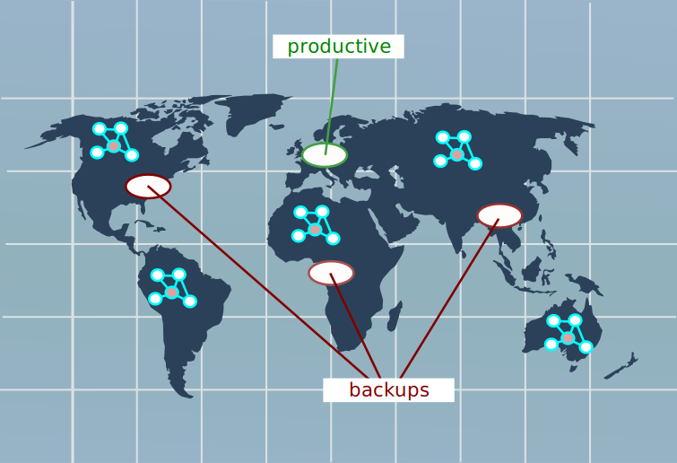

## Sensornetzwerke

Diverse einfache Sensoren bilden ein Mesh-Netzwerk, welches, je nach Anzahl, Verfügbarkeit und Aktivität der Knoten, eine unterschiedliche Struktur hat. An ein solches Netz sind (i.d.R. über mehrere Routen) Server angebunden auf denen die Daten gesammelt werden. Dort können dann von Benutzern Daten analysiert werden.

Eine mögliche Anwendung ist die Erfassung von Umweltdaten in einem ausgedehnten Waldgebiet.

---

---

---

## Sensornetzwerke

Details: https://www.generic.de/blog/sensornetzwerk-was-ist-es-und-wie-funktioniert-es

---

## Daten

- ID Sensor
- Messwerte
- Zeitstempel (Wichtig)
- Prüfsumme/Hash

---

---

### Betriebssystem

Da die Server auf normaler Hardware laufen, gibt es keine spezielle Anforderung, die nicht an andere DB-Server gestellt werden.

- Verfügbarkeit
- Robustheit
- Kosten (Lizenzen)
- Sicherheit

---

### Datenbankmanagementsystem

Um die wertvollen Daten aus dem Netz (den Netzen) zu sichern, muss es entfernte Backups (auf anderen Kontinenten) erlauben. Bei Ausfall eines Systems muss automatisch(?) ein redundantes System übernehmen?

---

### Datenbankmanagementsystem

---

### Datenbankmanagementsystem

- Sensoren dürfen Daten schreiben
- Benutzer dürfen (einige) Daten lesen aber nicht schreiben
- Daten kommen zeitlich versetzt an
- Daten kommen (eventuell) mehrfach an

---

### SQL

Die Schnittstelle für Anfragen der Benutzer ist SQL. Es sollte ein geläufiger Dialekt sein. Er sollte sich nicht kurzfristig ändern (Produktivumgebung).

Daten werden mit SQL geschrieben.

---

### Anwendungen 

Spezielle Anwendungen sind vor Allem für die Überwachung des Sensornetzes relevant.

---

### Anwendungen 

---

### Anhang

~~~dot

# http://www.graphviz.org/content/cluster

digraph G {
  graph [fontname = "Handlee"];
  node [fontname = "Handlee"];
  edge [fontname = "Handlee"];

  bgcolor=transparent;

  subgraph cluster_0 {
    //style=filled;
    color=lightgrey;
    node [style=filled,color=pink];
    s1 -> s2;
    s1 -> s3;
    s4 -> s1;
    s1 -> s4;
    s4 -> s2;
    s3 -> s1;
    s2 -> s4;
    s2 -> s1;
    s1 -> s5;
    s5 -> s1;
    label = "*Sensoren (Mesh)*";
    fontsize = 20;
  }

  subgraph cluster_1 {
    node [style=filled];
    Betriebssystem -> DBMS;
    DBMS -> Betriebssystem;
    DBMS -> DB;
    DB -> DBMS;
    label = "*DBS Europa*";
    fontsize = 20;
    color=blue
  }
  
  subgraph cluster_2 {
    node [style=filled];
    DBMS -> Backup_DB;
    label = "*Backup Asien*";
    fontsize = 20;
    color=red
  }
  
  s4 -> Internet;
  Internet -> s4;
  Betriebssystem -> Internet;
  Internet -> Betriebssystem;

  Betriebssystem -> Benutzer1;
  Benutzer1 -> Betriebssystem;
  Betriebssystem -> Benutzer2;
  Benutzer2 -> Betriebssystem;

  Internet [shape=Mdiamond];
  Benutzer1 [color=green];
  Benutzer2 [color=purple];
  
}
~~~
