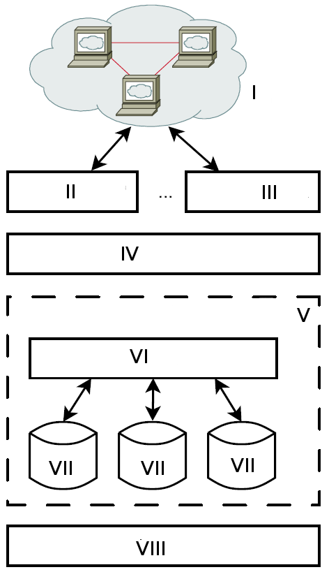

# GK Informatik Q2

## Datenbanksysteme

### Aufgaben

1. Hören Sie dem Fachvortrag zu dem Thema zu. Ordnen Sie die darin enthaltenen Fachbegriffe in einer eigenen Legende den Elementen zu.
2. Vergleichen Sie die Legende mit einer*m Mitschüler*in.
3. Bereiten Sie sich vor, Ihre Legende dem gesamten Kurs noch einmal vorzustellen.
