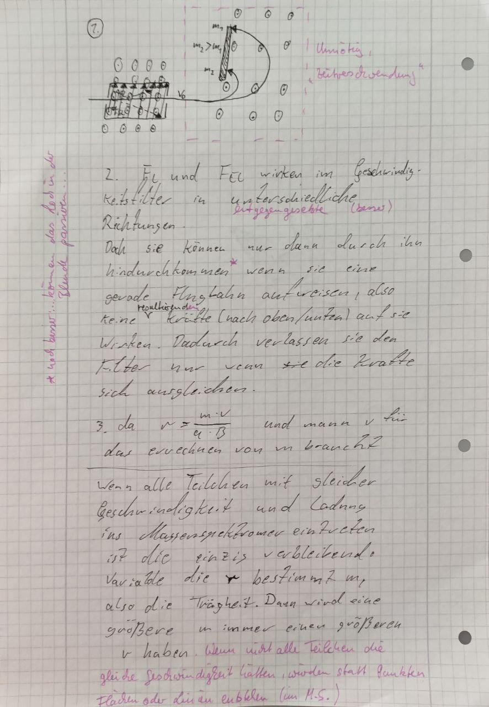

**Webseite mit Material der Physik**
	Klasse 13 2021-2022
                         
# GK Physik Q3 Woche 05

## Ziele

* ~~Wiederholung Feldbegriff~~
* ~~Wiederholung Vektoren~~
* ~~Elektronen im elektrischen Feld~~
  * ~~Kraftwirkung sprachlich beschreiben~~
  * ~~Kraftwirkung mathematisch beschreiben~~
  * ~~Anwendungsgebiete nennen und  Funktionsprinzipien beschreiben~~
* Elektronen im Magnetfeld
  * ~~Kraftwirkung sprachlich beschreiben~~
  * **Kraftwirkung mathematisch beschreiben**
  * ~~Anwendungsgebiete nennen und  Funktionsprinzipienbeschreiben~~
* ~~Verstehen, dass Energie quantisiert ist~~
  * ~~Aufbau des Millikan-Versuch beschreiben~~
  * ~~Ablauf des Millikan-Versuch beschreiben~~
  * ~~Schlussfolgerungen aus dem M-V nachvollziehen~~

## Inhalte

[Klasuraufgaben zur Übung](aufgabenblatt_klausurrelevant_01.md)

## Wienscher Geschwindigkeitsfilter

1. Erarbeiten Sie sich aus dem Lehrbuch die Funktionsweise des **Wienschen Geschwindigkeitsfilters**. Erstellen Sie dazu eine Skizze und notieren sich in Stichpunkten die wichtigsten Zusammenhänge.
2. Erläutern Sie, weshalb das Kräftegleichgweicht $F_L = F_{el}$ herrscht.
3. Begründen Sie, weshalb dieser Geschwindigkeitsfilter wichtig für die Massenspektroskopie ist.

### Musterlösung mit Feedback

## Aufgaben

Fokus Physik SII: S. 147 Nr. 3

### Lösung a

Skizze...

#### Geg:

$v = 1,75 \cdot 10^{6} m/s$

$B = 1,2 T$

$q = 1,602 \cdot 10^{-19} C$

$m = 9,109 \cdot 10^{-31} kg$

#### Ges:

r

#### Lös:

$r=\frac{m \cdot v}{q \cdot B}$

$r=\frac{9,109 \cdot 10^{-31} kg \cdot 1,75 \cdot 10^{6} m/s}{1,602 \cdot 10^{-19} C \cdot 1,2 T}$

$r=\frac{9,109 \cdot 10^{-31} \cdot 1,75 \cdot 10^{6}}{1,602 \cdot 10^{-19} \cdot 1,2 } \frac{kg m m A}{s A s N}$

$r=\frac{9,109 \cdot 1,75 \cdot 10^{-25}}{1,602 \cdot 1,2 \cdot 10^{-19}} \frac{kg ~ m^2 ~ A ~ s^2}
{s^2 ~ A ~ kg ~ m}$

$r=\frac{15,941}{1,922} \cdot 10^{-6} ~ m$

$r = 8,294 \cdot 10^{-6} ~ m$

#### Antw:

Der Radius eines Elektrons unter den gegebenen Umständen wäre rund 8μm.

