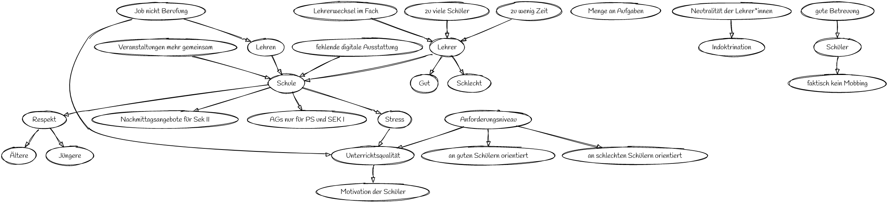

 Hosted on <a href='//sketchviz.com/' style='color:#555;'>Sketchviz</a>

~~~
# http://www.graphviz.org/content/cluster

digraph G {
  graph [fontname = "Handlee"];
  node [fontname = "Handlee"];
  edge [fontname = "Handlee"];

  bgcolor=transparent;
  
  Schule;
  Lehren -> Schule
  "Job nicht Berufung" -> Lehren;
  "Job nicht Berufung" -> "Unterrichtsqualität";
  Unterrichtsqualität -> "Motivation der Schüler";
  Lehrer -> Gut;
  Lehrer -> Schlecht;
  Anforderungsniveau -> "an guten Schülern orientiert";
  Anforderungsniveau -> "an schlechten Schülern orientiert";
  "Menge an Aufgaben";
  "Neutralität der Lehrer*innen" -> Indoktrination;
  "zu viele Schüler" -> Lehrer;
  "zu wenig Zeit" -> Lehrer;
  "Lehrerwechsel im Fach" -> Lehrer;
  Anforderungsniveau -> Unterrichtsqualität;
  Respekt -> Jüngere;
  Respekt -> Ältere;
  Schule -> Respekt;
  "fehlende digitale Ausstattung" -> Schule;
  Lehrer -> Schule;
  "gute Betreuung" -> Schüler;
  "Veranstaltungen mehr gemeinsam" -> Schule;
 Schule -> "Nachmittagsangebote für Sek II";
 Schule -> "AGs nur für PS und SEK I";
 Schüler -> "faktisch kein Mobbing";
 Schule -> Stress;
 Stress -> Unterrichtsqualität;

}
~~~
