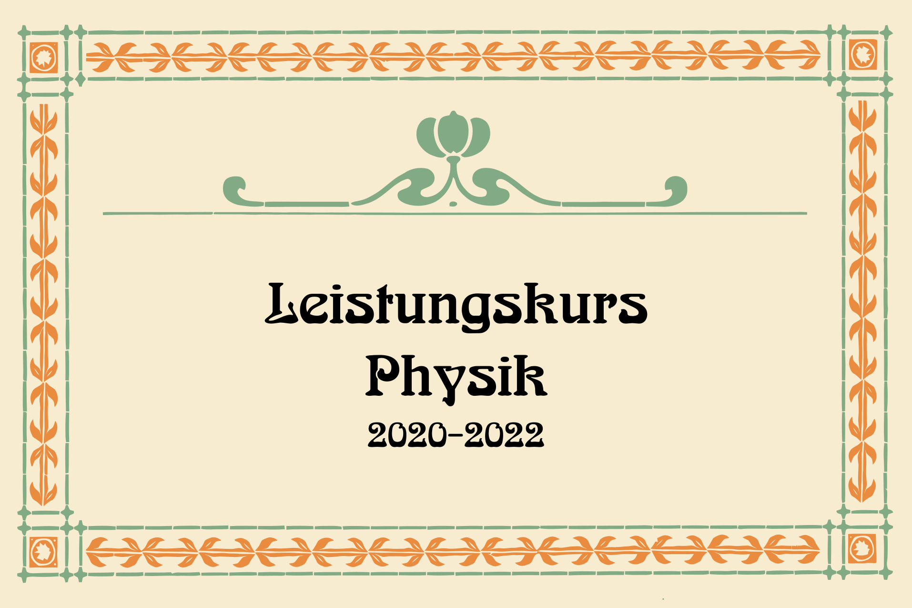

# LK Physik Q4

## Ziele (alt)

* Themen Q4 für Prüfung im Zentralabitur identifizieren
* Verschiedene Ursachen der Radioaktivität im Alltag benennen
* Entstehung radioaktiver Strahlung skizzieren
	* Alpha
	* Beta
	* Gamma
	* (schnelle) Neutronen (eigentlich keine radioaktive Strahlung aber wichtig, um Kettenreaktionen zu verstehen)
* Aufbau der Nuklidkarte nachvollziehen

## Ziele

* Wiederholung (sehr schnell)
* Emission und Absorption von Strahlung, 
* Durchdringungsvermögen
* Schwächungsgesetz 

## Inhalte

### Tabelle erstellen mit allen relevanten Informationen

siehe Hefter

### Strahlungsarten im elektrischen und magnetischen Feld

Hier nochmal zusammengefasst: https://www.lernhelfer.de/schuelerlexikon/physik/artikel/eigenschaften-radioaktiver-strahlung

### Absobtion und etwas Mathe

https://www.leifiphysik.de/kern-teilchenphysik/radioaktivitaet-fortfuehrung/grundwissen/absorptionsgesetz-absorptionskoeffizient-und-halbwertsschichtdicke

... lassen Sie uns das Geschehen experimentell überprüfen!

### Remember: Nuklidkarten

* https://www2.klett.de/sixcms/media.php/229/772425_1100_nuklidkarte.825366.pdf
* https://www.standardsicherung.schulministerium.nrw.de/cms/zentralabitur-wbk/faecher/getfile.php?file=2566
* https://www.egwoerth.de/images/Faecher/Physik/Physik_Nuklidkarte_EGW.pdf

interaktiv: https://www.physiklehrer.net/Nuklidkarte/
