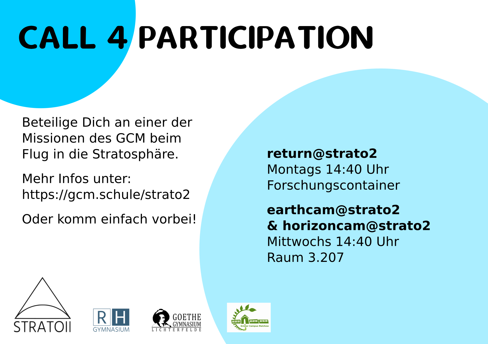
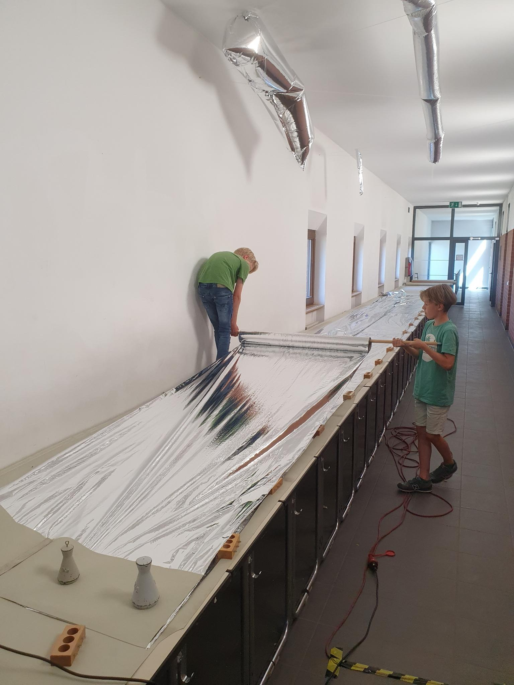
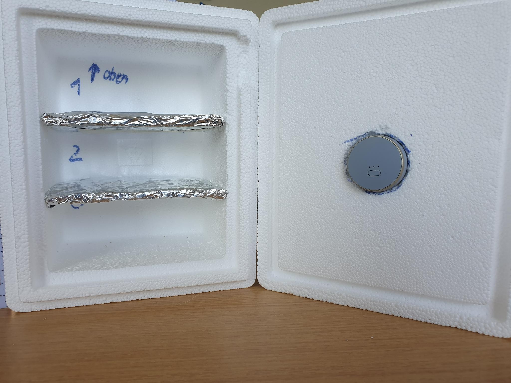

# Stratosphäre

WTH: Stratosphäre

[YT-Video zum Aufbau](https://www.youtube.com/watch?v=w_jXQXZKsZg)

## Strato 1

Waren wir noch nicht beteiligt.

## Strato 2

[Plakat Strato 2](Strato2_Montagsinfo.pdf)

Ging irgendwo in Polen herunter... Alle Technik verloren... und die Fotos.

## Strato 3

[GitHub-Repo](https://github.com/gruener-campus-malchow/strato3)

Energieversorgung brach zusammen... keine Bilder.

[HackN8-Video](https://www.youtube.com/watch?v=QQ8g2SL_spo)

[Erklärung des Fails und Fotos](https://youtu.be/QQ8g2SL_spo?t=196)

## Strato 4

Nächsten Dienstag (28.7.2022) ca. 16:00 Uhr vom Sportplatz des Robert Havemann Gymnasiums.

* 3 Kameras!
* Eigene Energieversorgung
* Max. 330g für Technik und Batterien.

## Offene Fragen

* Wie müssen die Batterien verknüpft werden?
* Welche Spannung haben wir dann?
* Halten wir das Startgewicht ein?
* Wie groß müsste der Ballon sein, wenn er nur unser Gewicht tragen muss?
* Wie können wir alles befestigen?
