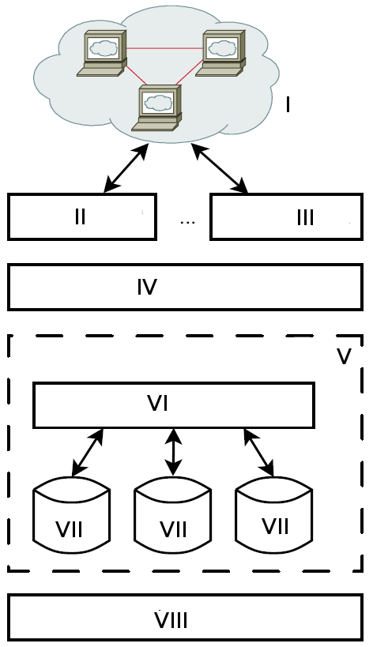

# Datenbankensysteme

---

---

## relationale Datenbanken

Relation = Tabelle

Funktion und Relation ist mathematisch das Gleiche: Mengenlehre

\\(f : X \rightarrow Y\\)

> Mengenlehre ist theoretische Grundlage der relationalen Algebra. 
> Relationale Algebra ist theoretische Grundlage für Datenbanken.

---

## relationale Datenbanken

Relation = Tabelle

\\(f : X \rightarrow Y\\)

X = {Schlüssel 1, Schlüssel 2, ...}

Y = { Tupel1, Tupel2, ... }

X = Menge aller Schlüsselattribute

Y = Menge aller Datensätze (Entitäten)

---

## Relation

> Eine Relation ist (vereinfacht) eine Abbildung von (Primär-) Schlüsseln auf eine Menge von gleichartigen Tupeln. 

> Ein Tupel ist eine Ansammlung von Attributen.

\\(\(y_1, y_2, ..,y_n\)\\)

---

### Tupel

\\(\(y_1, y_2, ..,y_n\)\\)

Bsp.:

(Peter, Arbeitsloser, arbl@gcm.schule, Arbeiter)

(Alexander, Baldauf, baf@gcm.schule, Arbeiter)

---

## Schlüssel

> Ein (zusammengesetzter Primär-) Schlüssel ist eine Teilmenge der Attribute, die alle anderen Attribute des Tupels eindeutig identifiziert.

\\(f : X \rightarrow Y\\)

---

## Schlüssel

Y= { (Peter, Arbeitsloser, arbl@gcm.schule, Arbeiter), (Alexander, Baldauf, baf@gcm.schule, Arbeiter)}

\\(f : X \rightarrow Y\\)

Schlüsselkandidat: \\(y_1\\)

f(Peter)=(Peter, Arbeitsloser, arbl@gcm.schule, Arbeiter)

f(Alexander)=(Alexander, Baldauf, baf@gcm.schule, Arbeiter)

---

## Schlüssel und Eindeutigkeit

Y= { (Peter, Arbeitsloser, arbl@gcm.schule, Arbeiter), (Alexander, Baldauf, baf@gcm.schule, Arbeiter)}

\\(f : X \rightarrow Y\\)

f(Arbeiter)= ???

---

## Schemata

> Ein Datenbankschema beschreibt nicht nur die Relationen (Art der Tupel mit Datentypen, Schlüsseln, Fremdschlüsseln, etc.) sondern auch weitere Metadaten, wie Zugriffsrechte, Statistiken oder andere Beschreibungen. Datenbankenschemata sind spezifisch für das jeweilige DBMS.

---

## Modelle

> Datenbankmodelle umfassen die Beschreibung und Strukturierung der Daten, Beispieldatensätze und sind unabhängig von spezifischen DBMS. Sie dienen dem Entwurfsprozess und werden üblicherweise am Ende der Entwicklungsphase in SQL überführt.

* Tabellen
* Relationenmodell
* Entity-Relationship-Model (Relationship != Relation)

---

# TODO

* Entity / Entität: (Dinge, abgeschlossene einzigartige Ganze) vs. Enitätenklasse
* ER-Modelle: Beispiel: Chatsystem in ER und Tabellen
* Schlüssel: Primärschlüssel, natürliche Schlüssel, künstliche Schlüssel, Fremdschlüssel