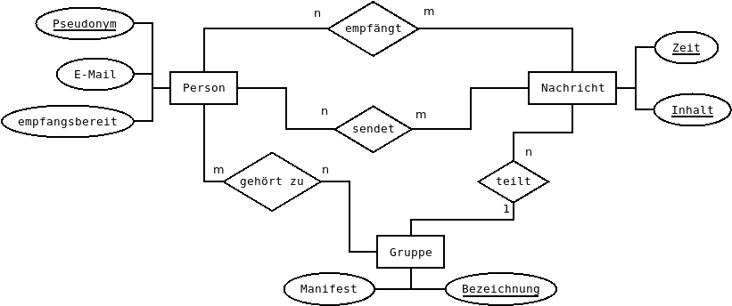

Übungen aus einer Klausur von 2019
=============

[toc]

# Material

## Szenario "MesswertStorageManagmentTool"

In einer Datenbank sollen beliebige Messwerte aus unterschiedlichsten Quellen gespeichert werden. 
Dabei wird jede Quelle mit einer Beschreibung, einer Bezeichnung, einem Ort und einer Supporttelefonnummer versehen.
Es gibt keine zwei Orte mit der gleichen Bezeichnung. Weitere Eigenschaften von Orten sind:
Bezeichnung, Straße, Hausnummer, Postleitzahl, Stadt und GPS-Koordinaten. An einem Ort können
mehrere Sensoren sein aber ein Sensor ist immer nur an einem Ort. Ein Sensor ist charakterisiert
durch eine Bezeichnung, eine Beschreibung und einen Typ. Die Bezeichnung eines Sensors
identifiziert ihn eindeutig. Ein Sensor kann nur einen einzigen Typ haben. Typen (von Sensoren)
haben eine Einheit, eine Typenbezeichnung und eine Beschreibung. Es kann mehrere Sensoren vom
gleichen Typ geben. Ein Messwert ist besteht aus der Vorkommastelle, der Nachkommastelle und
der Zeit an der er aufgenommen wurde. Ein Messwert muss einem Sensor zugeordnet sein.
Personen sind verantwortlich für mehrere Sensoren und ein Sensor kann von mehreren Personen
betreut werden. Personen haben einen Vornamen und Nachnamen und eine E-Mailadresse für die
Kontaktaufnahme bei Fehlern oder Fragen.

## ERM "Nachrichtensystem"

## Relationen für ein Redaktionssystem

~~~SQL
article(url_PK,title, author_FK, content, tag_FK, creation_date, publish_date, last_edit_date, authorised, authorised_by_author_FK)
author(username_PK, prename, lastname, pseudonym, mail, hash, first_login_date)
tag(tag_PK, description)
comment(url_PK, content, creator, article_FK, creation_date,authorised, authorised_by_author_FK)
~~~

# Aufgaben

## Modellieren (ca. 45 Minuten)

### Datenbank als ERM aus Text entwerfen (15 BE, AB 2)

Entwickeln Sie aus dem Text in MesswertStorageManagmentTool ein Entity-Relationship-Model. Seien Sie dabei möglichst konservativ, also erfinden Sie keine zusätzlichen Attribute.

### ERM in Relationenschreibweise überführen (15 BE, AB 1)

Überführen Sie das ER-Modell in Nachrichtensystem in Relationenschreibweise.

### Relationenschreibweise in SQL überführen (15 BE, AB 2)

Erzeugen Sie CREATE-Statements aus den Relationen in Relationen für ein Redaktionssystem. Primärschlüssel haben den Suffix _PK.
Fremdschlüssel erkennen Sie an dem Suffix _FK und dem Namen des Attributs, der auf die
gleichnamige Relation verweist. Als Datentypen stehen Ihnen: TEXT, VARCHAR(255), INTEGER
und DATETIME zur Verfügung.

## SQL (ca. 45 Minuten)

### Anfragen stellen (15 Minuten, AB 2)

Entwerfen Sie eine Anfrage für das ERM in Nachrichtensystem, die

a) ... die Anzahl der gesendeten Nachrichten pro Person ausgibt.

b) ... alle Nachrichten, die „Bob“ empfangen hat, sortiert nach Zeit, ausgibt.

### Datensätze speichern (15 Minuten, AB 3)

Entwerfen Sie Anfragen für das ERM in Nachrichtensystem, so dass jede Entität existiert und über
tatsächliche Datensätze verknüpft wird. Alle Beziehungen sollen berücksichtigt werden. Achten Sie
auf die richtige Reihenfolge, damit keine Verweise auf nicht existierende Daten entstehen. Gehen
Sie davon aus, dass alle Anfragen nacheinander und einzeln ausgeführt werden.

### Datensätze ändern (15 Minuten, AB 2)

Ändern Sie mindestens einen fiktiven Datensatz pro Entität aus dem ERM in Nachrichtensystem.
Sollte eine Beziehung dadurch verändert werden müssen, muss dies in diesem Fall ausdrücklich
durch eine Anfrage geschehen.

# Lösungen

[Lösungen zur selbständigen Kontrolle und(!) zur Diskussion](07_Klausurvorbereitung_Modelle_SQL_Lösungen.md)
