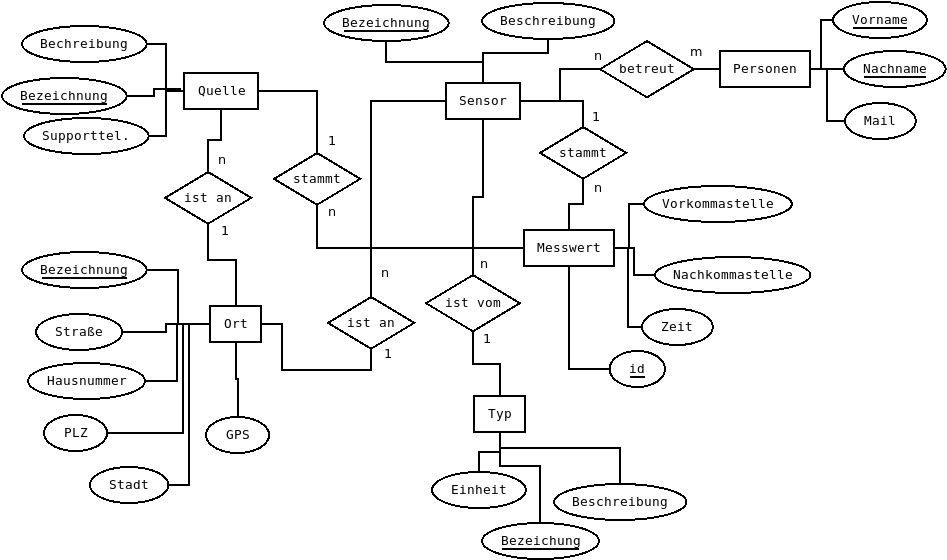

Lösungen zur Übungsklausur von 2019
=============

> Bitte beachten Sie: Manche Designentscheidungen würden bei einer Korrektur im Sinne des Prüflings entschieden. Folglich ist die Musterlösung i.d.R. eine mögliche Lösung und Abweichungen im Rahmen der Aufgabenstellung sind möglich.

## Datenbank als ERM aus Text entwerfen

