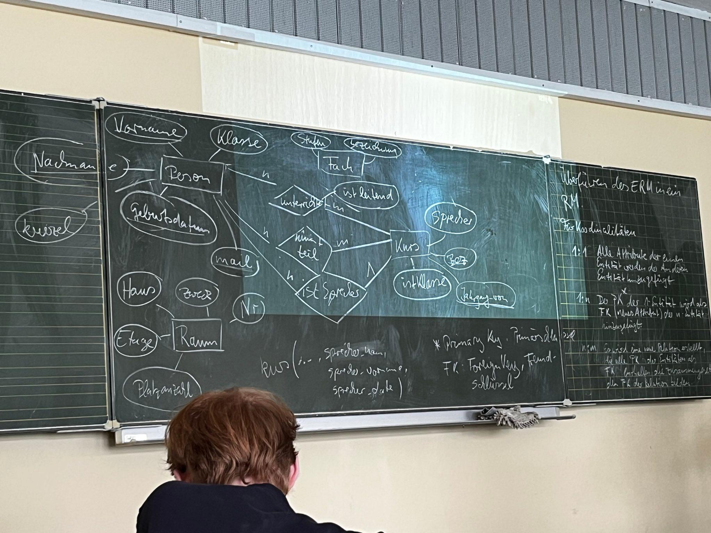
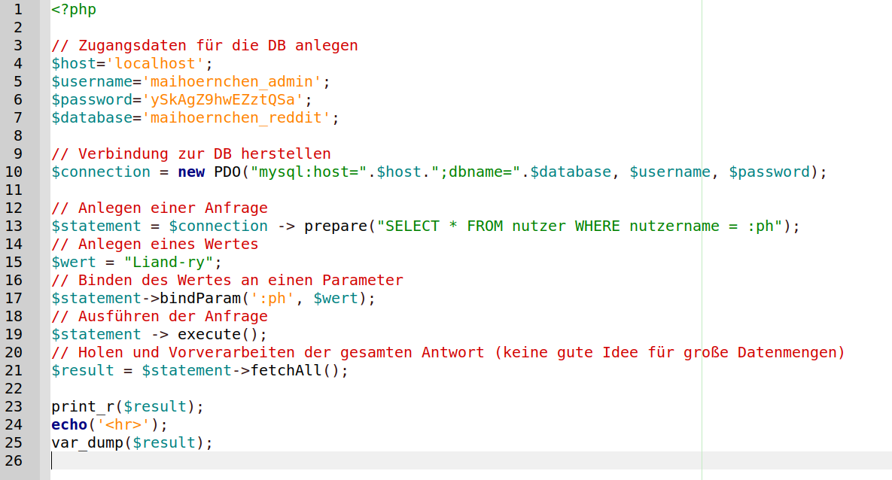

GK12 Informatik 2022/23
=======================

[toc]

*Willkommen!*

In diesem Dokument werden im Verlauf des Jahres diverse Materialien und Aufgaben zusammengestellt, die zum Slebstlernen und Lernen in der Schule geeignet sind.

Zunächst besprechen wir ein wenig [Organisatorisches](01_intro-orga.slides.md).

# Webentwicklung

Hier geht es um Markdown, HTML und CSS.

## Markdown

[Steckbriefe](./steckbriefe.md)

## PHP

- [Erste Schritte](02_erste_schritte.md)
- [Auf zum Server](02_client-server.slides.md)

## Softwareentwicklung

- [Einführung in GIT](03_git_einführung.md)
- [Transparenzpapier Klausur](04_transparenzpapier_klausur.md)
- SCRUM-Theorie im Lernraum

# Q2

- [2023-01-05](./05_projektplanung_product-backlog.md)

## Datenbankensysteme

- [Einführung](06_Einführung_DBMS.md)

### Funktionen eines DBMS

Der erste Abschnitt von https://de.wikipedia.org/wiki/Datenbank#Funktionen_eines_DBMS stellt eine Übersicht und Verlinkungen auf weiterführende Artikel dar.

Nach einer Sichtung von 10 Minuten teilen wir diesen Komplex in ca. 6 Kurzvorträge auf, die als Einzelarbeit zu halten sind. Medium ist, wie immer, [CampusSlides](https://docs.gcm.schule/slides/).

Die (kreative) Anforderung ist: Es dürfen keine Sichpunkte, sondern nur Bilder oder Grafiken (die dann Worte beinhalten dürfen) verwendet werden.

Für das Speichern und Sichern der Vorträge gibt es eine Abgabe im Lernraum.

Have a lot of fun!

## Theorie-Sessions

Wir haben folgende Fachinhalte erarbeitet:

- Modellierung in Tabellen
- Relationenmodell (RM)
- Entity-Relationship-Models (ERM)
    - (Kardinalitäten) in RM überführen

### Praxisteil 1

- gemeinsames ERM entwickeln
- Diversifizierung und Spezialisierung paarweise
- selbständiges Überführen in RM

~~~SQL

Person(_vorname_, _nachname_, _geburtsdatum_, mail, kuerzel, Klasse, Kursjahrgang)
Raum(_haus_, _etage_, _nr_, zweck, paltzzahl, Fach.bezeichnung)
Fach(_bezeichnung_, stufen)
Kurs(_jahrgang_von_, _bezeichnung_, istKlasse, Fach.bezeichnung, Raum.haus, Raum.etage, Raum.nr)
Unterrichtet(Person.vorname, Person.nachname, Person.geburtsdatum, Kurs.bezeichnung, Kurs.jahrgang_von)
Nimmt_Teil(-||-) #siehe Unterrichtet -,-

~~~

### Praxisteil 2

Viele der hier genannten Schritte werden im Lernraum mit Abgaben der Arbeitsergebnisse kombiniert.

- paarweise ein ERM zu einem Szenario entwickeln
- Vorstellen des ERM im Auditorium
- Überführung in ein RM
- Einführung in SQL bzw. DDL (Theorie im Praxisteil)
- Entscheidung: Arbeit mit MariaDB/MySQL statt mit SQLite
- Überführen des RM in CREATE-Statements
- Testen mit eigenen Datenbanken mit Hilfe von phpMyAdmin auf bplaced.net

Beispiel:

~~~SQL

CREATE TABLE nutzer(
	id INT PRIMARY KEY AUTO_INCREMENT, 
	nutzername VARCHAR(100) NOT NULL, 
	passwort VARCHAR(255) NOT NULL, 
	datum DATE, 
	email VARCHAR(255) NOT NULL, 
	beschreibung TEXT, 
	bild BLOB, 
	link VARCHAR(255)
)

~~~

#### INSERT-Queries

TODO Beispiel...

### Klausurvorbereitung

* [Übungsklausur von 2019](07_Klausurvorbereitung_Modelle_SQL.md)
* [Transparenzdokument Klausur Q2](08_transparenzdokument_Klausur_Q2.md)

### Praxisteil 3

#### SELECT-Queries

##### Vollständige Tabelle von Datenbank abfragen 

~~~SQL
SELECT * FROM table01;
~~~

##### Spezielle Attribute von Tabelle abfragen (Projektion)

~~~SQL
SELECT (attr01,attr02,attr03) FROM table01;
~~~

##### Daten aus einer Tabelle mit Einschränkungen (Selektion)

~~~SQL
SELECT (attr01,attr02,attr03) FROM table01 
    WHERE
        attr01 = 1
    AND
        attr02 > 100;
~~~

##### Daten aus mehreren Tabellen mit Einschränkungen (eigentlich JOIN)

> ACHTUNG: Im Unterricht behandeln wir den JOIN nur implizit und überlassen dem DBS das Verknüpfen der Tabellen. In der Theorie wird hier zwischen vielen JOINs (left, right, outer, inner, usw.) unterschieden, die im Kern als Kreuzprodukt verarbeitet werden.

*table01*

| id | value | foreign_key |
| -- | ----- | ----------- |
| 1  | a     | 2           |
| 2  | b     | 2           |
| 3  | c     | 1           |

*table02*

| id | value |
| -- | ----- |
| 1  | foo     |
| 2  | bar     |

~~~SQL
SELECT * FROM table01, table02
    WHERE 
        foreign_key = table02.id
~~~

#### Aufgaben

Erstellen Sie für Ihre Beispieldatenbank für jeden der hier dargestellen SELECT-Typen eine Beispielanfrage. Erstellen Sie eine (Slides-) Präsentation, die sowohl Ihre Anfrage, als auch das Ergebnis der Datenbank darstellt. Gehen Sie in der Präsentation auf überraschende Erscheinungen und/oder Probleme ein.

Nettes Tool zum Umwandeln von Tabellen in MD-Code: https://tabletomarkdown.com/

Ein noch netteres Tool: https://tableconvert.com/

## Planung der 5. PK Simulationen

ab 19.6. stehen Termine zur Verfügung in der hier stehenden Reihenfolge ist entscheidend

Zwei Vorträge pro Doppelstunde oder ein Vortrag pro Einzelstunde

[Hintergrundinformationen hier](5pk_simulation_2023.md)

https://www.berlin.de/sen/bildung/schule/pruefungen-und-abschluesse/abitur/handreichung_5pk.pdf

### Client-side storage

* A.R. & E.M.
* 25 Minuten Vortrag, 15 Minuten Gespräch
* 19.6.2023

### Bandbibliotheken (Tape Libraries)

* M.B. & A.M.
* 25 Minuten Vortrag, 15 Minuten Gespräch
* 22.6.2023

### Die Trennung von MySQL und MariaDB

* O.M.
* 20 Minuten Vortrag, 10 Minuten Gespräch
* 26.6.2023

## Zugriff auf Datenbanken mit PHP

Erstellen und testen Sie eine PHP-Datei, die ähnlich wie das Beispiel eine beliebige Anfrage auf Ihrer Beispieldatenbank ausführt. Laden Sie die PHP-Datei im Lernraum hoch.

## Roadmap

- DBs aus Programmen benutzen (PHP&MySQL)
    - Prepared Statements (schöne Grafik erstellen)
    - Die HTML-Universaltabelle
    - PHP als Webservice (API: MySQL->JSON)
    - DIE

> Have a lot of fun!
