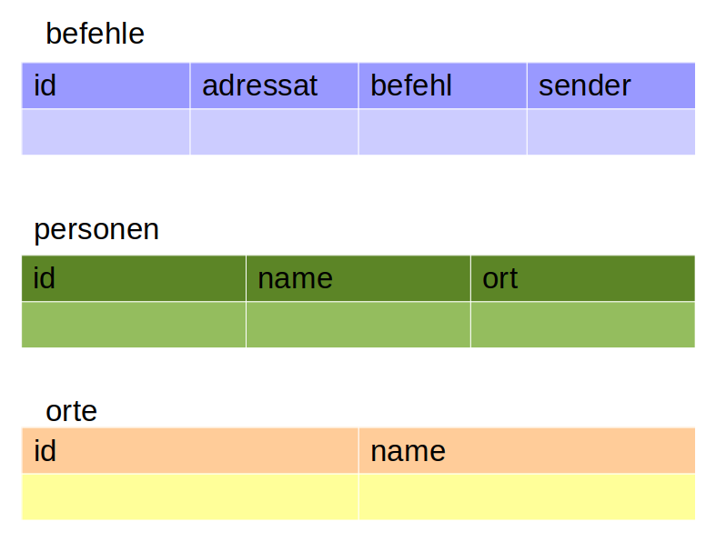
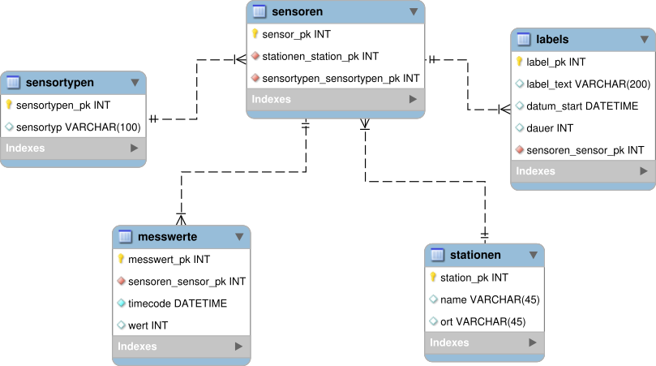

# Einführung DML

Um Tabellen zu erstellen, kann man SQL-CREATE-Statements verwenden. Der Folgende Code ist für sqlite optimiert.

~~~sql

CREATE TABLE personen (id INTEGER PRIMARY KEY AUTOINCREMENT);

CREATE TABLE befehle
(
id INTEGER PRIMARY KEY AUTOINCREMENT,
adressat INTEGER NOT NULL,
befehl TEXT,
sender INTEGER NOT NULL,
FOREIGN KEY (adressat) REFERENCES personen(id),
FOREIGN KEY (sender) REFERENCES personen(id),
);

~~~

## Aufgabe

Erstellen Sie CREATE-Statements für folgende Relationen.

# Daten in die Datenbank einfügen

~~~sql
INSERT INTO befehle(adressat, befehl, sender) VALUES
(2,"Fliegen Sie nach Andromeda",1),
(2,"Melden Sie sich bei der Sternenflotte",1),
(14,"Reparieren Sie den Warpantrieb",2);
~~~

Ein Beispiel aus dem (ehemaligen) Produktivbetrieb (Achtung, das ist MySQL/MariaDB):

## Daten von 2016/2017

* [Daten Vorschau (32kb)](./wetterdatenbank_kurz.sql)
* [Daten Vollständig (42mb)](./wetterdatenbank.sql)

Freiwillige interessante Aufgabe: Transformieren Sie die SQL-Queries von MariaDB nach SQLite... Spielen Sie damit!

## Aufgabe

1. Füllen Sie Ihre Datenbank mit Beispieldaten.
2. Passen Sie Ihre Datenbank an: Es fehlt komplett der Zeitkontext - seien Sie kreativ!

# Daten aus einer Datenbank abrufen

Hier wird es Schritt für Schritt erklärt: https://www.sqlitetutorial.net/sqlite-select/

## Aufgabe

1. Entwerfen Sie ein paar nützliche oder sinnvolle Abfragen
1. Präsentieren Sie Ihre Abfragen und die Ergebnisse in einer Präsentation mit https://slides.gcm.schule (Tipp: Image-Upload-Tutorial https://www.youtube.com/watch?v=G9b501I_rjs)
 * ERM
 * Beispielcode CREATE
 * Beispielcode INSERT
 * Beispielcode SELECT
 * Ergebnis der SELECT-Query
