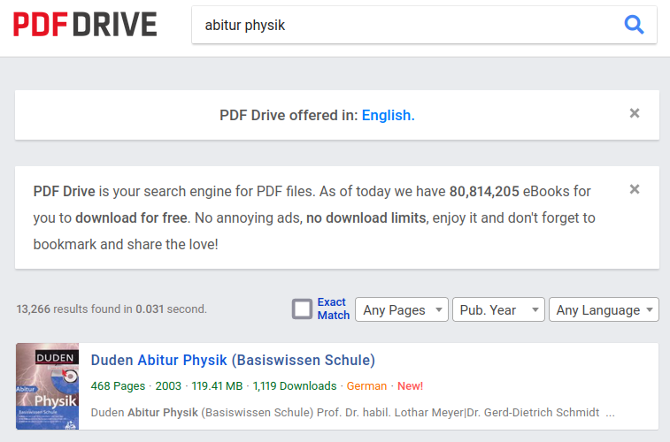

---

# Gravitation

---

## Newtonsches Gravitationsgesetz

1. Skizze in Hefter erstellen
1. Formel in Hefter erstellen
1. Simple Aufgaben erfinden (jeder eine!)

---

## Newtonsches Gravitationsgesetz

### Problemstellung

Wenn Erde und Mond (oder auch Planeten und Sonne) sich anziehen, warum prallen sie dann nicht aufeinander?

---

Wenn Erde und Mond (oder auch Planeten und Sonne) sich anziehen, warum prallen sie dann nicht aufeinander?

~~~
Annahmen: Kreisbahn, Reibungsfrei, r approx R, ...
Ziel: 1. kosmische Geschwindigkeit
Kräftegleichgewicht: F_Grav = F_Rad
~~~

1. Skizze in Hefter erstellen
1. Formel in Hefter erstellen
1. Simple Aufgaben erfinden (jeder eine!)
