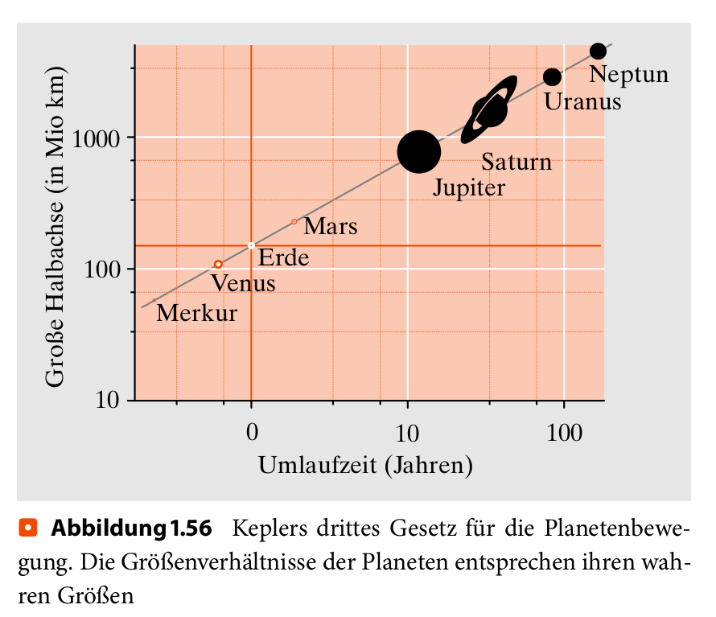

## Keplersche Gesetze

### Erstes Keplersches Gesetz

Die Planeten bewegen sich auf elliptischen Bahnen. In einem ihrer Brennpunkte steht die Sonne.

### Zweites Keplersches Gesetz

Ein von der Sonne zum Planeten gezogener Fahrstrahl überstreicht in gleichen Zeiten gleich große Flächen.

### Drittes Keplersches Gesetz

Die Quadrate der Umlaufzeiten zweier Planeten verhalten sich zueinander wie die Kuben (dritten Potenzen) der großen Halbachsen ihrer Bahnellipsen.

---

## Erstes Keplersches Gesetz

Funktioniert ganz gut, wenn man sehr große Massen gegen sehr kleine Massen einsetzt.

---

### Erstes Keplersches Gesetz

Tatsächlich "eiert" die Sonne mit den Planeten um einen gemeinsamen Schwerpunkt.

---

### Erstes Keplersches Gesetz

Formulieren Sie Schlussfolgerungen, die aus dem ersten Keplerschen Gesetz folgen.

Sichworte: Kreisbahn, Abstände, Verhältnis der Massen

---

### Zweites Keplersches Gesetz

Ein von der Sonne zum Planeten gezogener Fahrstrahl überstreicht in gleichen Zeiten gleich große Flächen.

---

### Zweites Keplersches Gesetz

Formulieren Sie Schlussfolgerungen, die aus dem zweiten Keplerschen Gesetz folgen.

Sichwort: Geschwindigkeiten im Jahresverlauf

---

### Drittes Keplersches Gesetz

Die Quadrate der Umlaufzeiten zweier Planeten verhalten sich zueinander wie die Kuben (dritten Potenzen) der großen Halbachsen ihrer Bahnellipsen.

---

### Drittes Keplersches Gesetz

Die Quadrate der Umlaufzeiten zweier Planeten verhalten sich zueinander wie die Kuben (dritten Potenzen) der großen Halbachsen ihrer Bahnellipsen.

---

### Drittes Keplersches Gesetz

Formulieren Sie Schlussfolgerungen, die aus dem dritten Keplerschen Gesetz folgen.

Sichworte: Geschwindigkeiten im Vergleich
