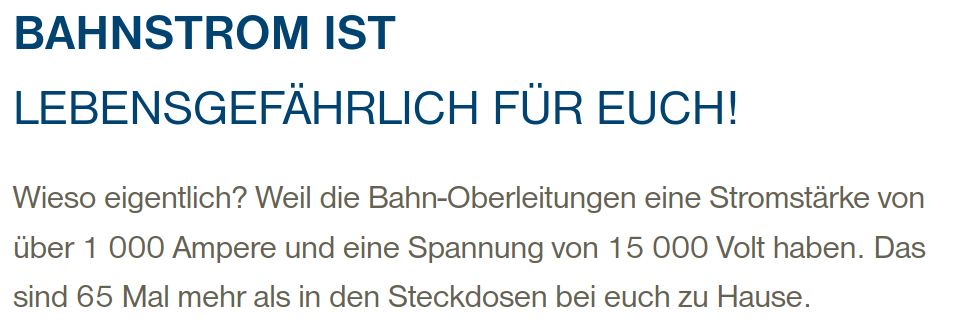

## Orga

* Passwörter iServ

---

## gerader Leiter

Magnetfeld eines geraden stromdurchflossenen Leiters

$$
B = {\mu}_0 {\mu}_r { {I} \over {2 \pi \cdot r}}
$$

Skizze!

---

## gerader Leiter

https://www.bafu.admin.ch/bafu/de/home/themen/elektrosmog/fachinformationen/elektrosmog-quellen/hochspannungsleitungen--freileitungen--als-elektrosmog-quelle.html

https://www.bundespolizei.de/Web/DE/02Sicher-im-Alltag/04Sicher-auf-Bahnanlagen/01_Eigene-Vorsicht/150602_bahnstrom_flyer-jugendliche_file.pdf

---

## Magnetische Flussdichte (Q3 Kreuzprodukt)

Wenn die Winkel B zu I nicht rechtwinklig sind:

$$
F =  B \cdot I \cdot l \cdot \sin{\alpha}
$$

bzw.

$$
\vec{F} =  l ( \vec{I} \times \vec{B} )
$$

---

## Magnetische Feldstärke

$$
B = {\mu}_0 {\mu}_r H
$$

- magnetische Feldkonstante ist Proportionalitätsfaktor
- Permeabilitätszahl ist Materialkonstante

---

## Rechnen

siehe Lehrbuch Duden

---

## Orga

- Termine eintragen
- Weihnachtsfeier: 21.12.22 8:00 bis 12:30
  - Vorschläge, Komission?, Aktionen?

---

## Klausuren

- Aufgaben schrittweise besprechen