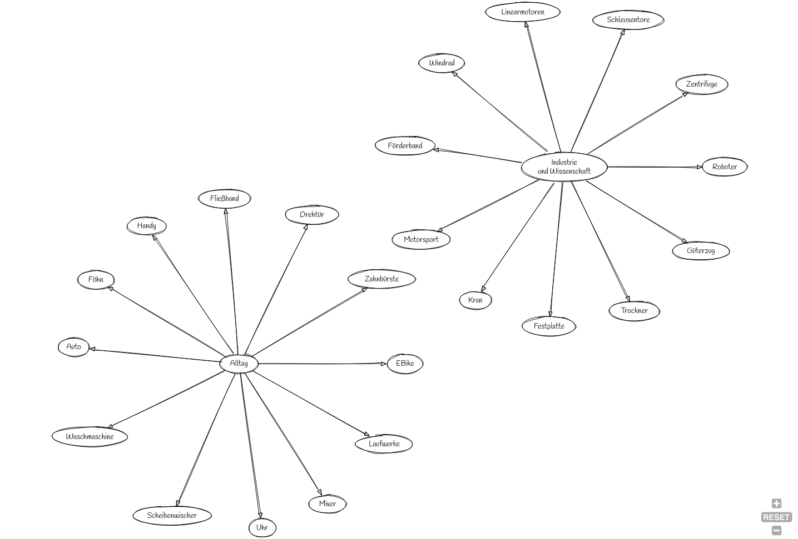

## Elektromotoren

Kurze Sammlung an Einsatzgebieten!

> Notieren Sie drei Anwendungen aus dem Alltag.

> Notieren Sie drei Anwendungen aus Industrie und Wissenschaft.

5 Minuten

---

---

 EBike;
 Alltag -> Zahnbürste;
 Alltag -> Drehtür;
 Alltag -> Fließband;
 Alltag -> Handy;
 Alltag -> Föhn;
 Alltag -> Auto;
 Alltag -> Waschmaschine;
 Alltag -> Scheibenwischer;
 Alltag -> Uhr;
 Alltag -> Mixer;
 Alltag -> Laufwerke;
i [label="Industrie \n und Wissenschaft"];
i -> Roboter;
i -> Zentrifuge;
i -> Schleusentore;
i -> Linearmotoren
i -> Windrad;
i -> Förderband;
i -> Motorsport;
i -> Kran;
i -> Festplatte;
i -> Trockner;
i -> Güterzug;
}
'/>

---

## Aufgabenstellung

Erklären Sie die Funktionsweise des einen oder anderen Elektromotors.

- Gleichstrommotor
    - Pool A: Julian, BenS, Emil
    - Pool B: Jermaine, Aaron, Toni
    - Pool C: Jolina, BenM, Philipp, Oganes
- Wechselstrommotor
    - Sebastian, Marco, Avidan
- Schrittmotor (Stepper)
    - Max, Finnegan, Floe

---

