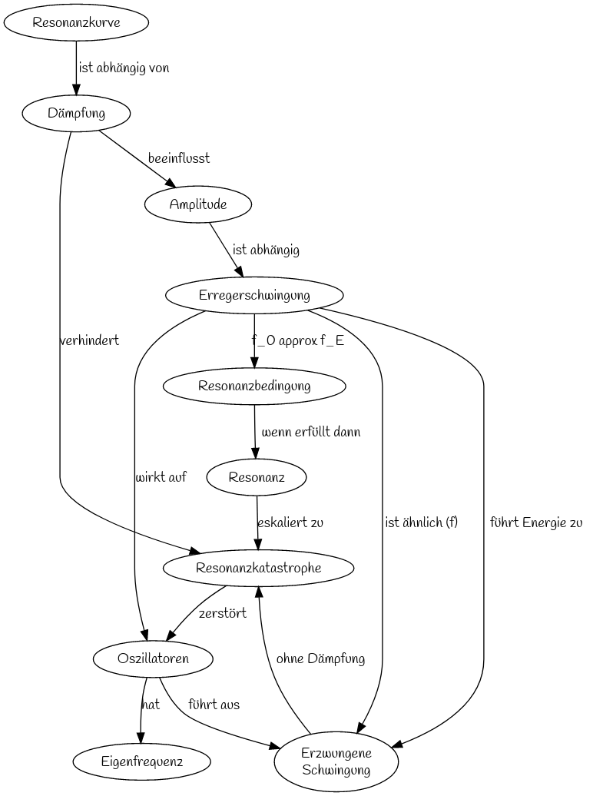

Leistungskurs Physik Klasse 12 2022-2023
========================================

~~~markdown
digraph G {
  graph [fontname = "Handlee"];
  node [fontname = "Handlee"];
  edge [fontname = "Handlee"];

  bgcolor=white;

  R [label="Resonanz"];
  Err [label="Erregerschwingung"];
  Erz [label="Erzwungene\nSchwingung"];
  K [label="Resonanzkatastrophe"];
  O[label="Oszillatoren"];
  D[label="Dämpfung"];
  RK[label="Resonanzkurve"];
  E[label="Eigenfrequenz"];
  RB[label="Resonanzbedingung"];
  A[label="Amplitude"]

  O -> E [label="hat"];
  RK -> D [label="ist abhängig von"]
  Err -> O [label="wirkt auf"]
  Err -> Erz [label="ist ähnlich (f)"]
  Err -> RB [label="f_0 approx f_E"];
  O -> Erz [label="führt aus"]
  Err -> Erz [label="führt Energie zu"]
  Erz -> K [label="ohne Dämpfung"]
  RB -> R [label="wenn erfüllt dann"];
  R -> K [label="eskaliert zu"];
  D -> K [label="verhindert"];
  K -> O [label="zerstört"]
  A->Err [label="ist abhängig"]
  D->A [label="beeinflusst"]
}

~~~

