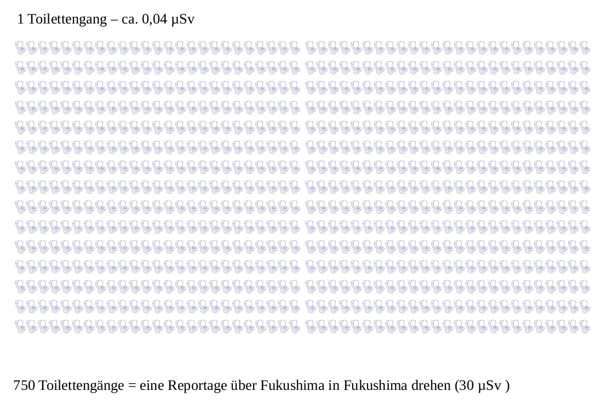

# LK Physik Q4

## Wiederholung Strahlendosis

- Welche Möglichkeiten der Messung radioaktiver Strahlung gibt es?
- Erstellen wir eine Tabelle

## Beispiel für Grafiken

[Größenverhältnisse](groessenverhältnisse.svg)

## Folgen einer Katastrophe

https://www.youtube.com/watch?v=aM_HbyIBbwc

### Aufgaben

1. Notieren Sie die Inhalte des Films, sodass Sie im Anschluss die einzelnen "Kapitel" zusammenfassen könnten.
2. Suchen Sie sich einen der genannten Messwerte zur Strahlendosis heraus. Stellen Sie die Größenverhältnisse ähnlich dar, wie oben gezeigt.

#### Ben

## Marie Curie und die Entdeckungen ihrer Zeit

https://youtu.be/xA6koch5Tk0

### Aufgaben

1. Notieren Sie alle radioaktiven Elemente, die im Film genannt werden.
2. Recherchieren Sie zu jedem Element
    3. je drei radioaktive Isotope
    4. die zugehörigen Halbwertszeiten
1. Bestimmen Sie für die Isotope jeweils
    5. die Zerfallsgleichung
    6. die Aktivität für je 1g Probe
1. Beurteilen Sie für jedes der Elemente ihre Gefährlichkeit und geben Sie begründete Hinweise zu ihrer sicheren Lagerung.