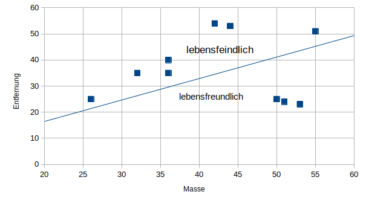

Grundkurs Informatik
========================

# Was bisher geschah

- Sinn und Nutzen von APIs
- Vorträge zu den Anforderungen an RESTful APIs
- [URI-Schema](./uri.md) und http-Methoden
	- Einheitlichkeit...

https://docs.gcm.schule/slides/#/v5BxbF_TYlxZFSbyzKg

# Todo

- Wiederholung: https://www.w3schools.com/tags/ref_httpmethods.asp
- Beispiel-Requests sammeln

Erstellen Sie eine (digitale) Tabelle zu ihren drei Requests, die folgendem Schema entspricht. Es sollen pro Request alle (sinnvollen) Methoden aufgeführt und passende SQL-Queries entworfen werden.

Nützliches Tool: https://tableconvert.com/markdown-generator
	
| Request     | Methode | SQL-Query           |
|-------------|---------|---------------------|
| /api/items/ | GET     | SELECT * FROM items |
| ...         | POST    | ...                 |

Beim Zusammentragen Ihrer Arbeitsergebnisse (Github, Vorschlag?!) wäre es günstig, eine Grobstruktur / Ordnung festzulegen.

- Wiederholung SCRUM@School
	- Welche Artifakte brauchen wir?
	- Welche Rollen brauchen wir?
	- Welche Events brauchen wir?
	- Wie teilen wir die Arbeit ein?
- Arbeitsplanung!

> Anmerkung: Wir haben ziemlich viel Projektarbeit mit github organisiert, was hier nicht abgebildet worden ist. Das Ergebnis ist im [Projekt Colamator](https://github.com/gruener-campus-malchow/colamator) zu finden.

# Q4 (KI)

## Erste Stunde

- Vortrag Einführung und Zusammenfassung des Readers
- HA zur zweiten Stunde: Reader 01

## Zweite Stunde

- Reader 02 lesen

> Sie sollen Planeten in lebensfreundliche Planeten und Planeten, die lebensfeindlich sind, unterscheiden. Dazu werden der Abstand zum Zentralgestirn und seine Masse als Messwerte genommen. **Skizzieren** Sie das Problem in einem Koordinatensystem. **Erläutern** Sie anhand Ihrer Skizze, wie Sie einen linearen Klassifizierer so trainieren, dass Ihr System schließlich automatisch anhand der Messwerte neue Entdeckungen einordnet.

### Musterlösung Skizze

