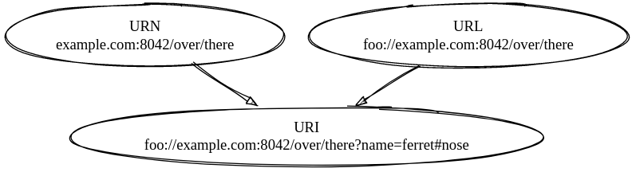

URI (Uniform Resource Identifier)
=================================

[toc]

# Geschichte 
- Grundgedanke: 
  - Tim Berners-Lee (Gründer)
- Einführung des Bergriffs 1994 
- erstes W3C-Dokument mit Uniform später

# Definition

> Die URI ist dafür da, abstrakte und physische Ressourcen zu identifizieren und somit spezifische Informationen aus dem Internet zu erlangen

# Funktion

- kann Sender und Empfänger bspsw. einer E-Mail identifizieren 
- aus der URI kann das System ablesen wo und wie bestimmte Informationen identifiziert werden sollen
- Identifizierung durch festgelegte Syntax

# Syntax

- als Zeichenfolge kodiert 
- es dürfen keine Leerzeichen verwendet werden

# Bestandteile

## Scheme

gibt an wie Informationen wie das Protokoll benutzt wird

## Authority

identifiziert die Domain

## Path

zeigt den exakten weg zur resource

## Query

repräsentiert eine Anfrage
  

## Fragment

ein Teil der Ressource, bei Html-Seiten z.B. ein Anchor-Tag

## Übersicht

~~~    '
            foo://example.com:8042/over/there?name=ferret#nose
            \_/ \________________/\_________/ \_________/ \__/
             |          |             |            |        |
          scheme    authority        path        query   fragment
             |   _____________________|__
            / \ /                        \
            urn:example:animal:ferret:nose
~~~

## Unterschied URI und URL

## Quellen

- https://www.ionos.com/digitalguide/websites/web-development/uniform-resource-identifier-uri/

  Datum: 21.12.2021  |  Uhrzeit: 11:53 Uhr 

- https://de.wikipedia.org/wiki/Uniform_Resource_Identifier

  Datum: 21.12.2021  |  Uhrzeit: 11:54 Uhr

- https://whatis.techtarget.com/definition/URI-Uniform-Resource-Identifier

  Datum: 21.12.2021  |  Uhrzeit: 11:54 Uhr 
