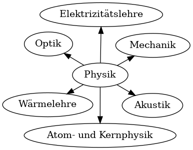
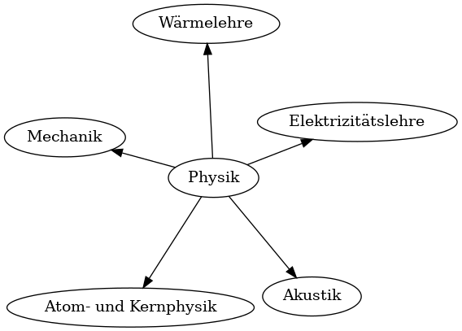
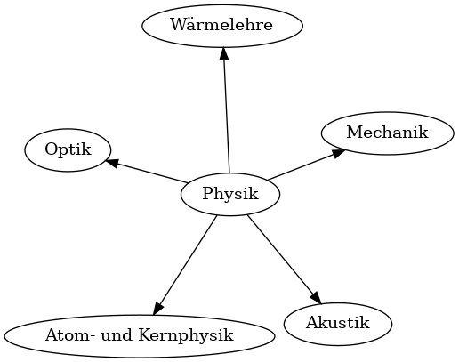
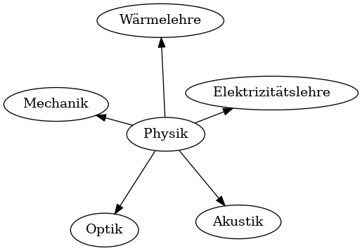
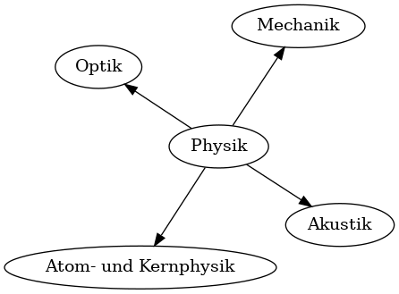
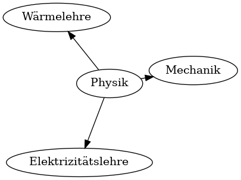
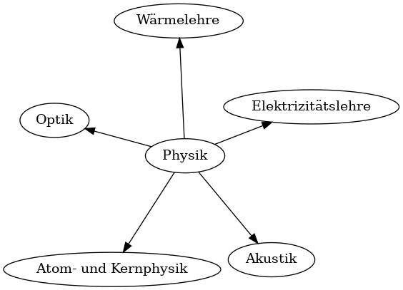

# Teilgebiete der Physik

---

## Atom- und Kernphysik

- kleinsten Bausteine der Materie: Atomen und ihren Kernen
- wie sind Atome aufgebaut (Elementarteilchen)
- wie verhalten sich Elementarteilchen 

---

## Akustik

- Klang und Schall
- wie werden Schallwellen erzeugt, übertragen und wahrgenommen 

---

## Optik

- Verhalten von Licht 
- Wechselwirkung von Licht mit Materie
- Reflexion, Brechung, Absorption und Farbwahrnehmung
- wichtig für die Entwicklung von optischen Instrumenten wie Mikroskopen und Teleskopen

---

## Mechanik

- Lehre von den Kräften und Bewegungen von Körpern
- wie bewegen sich Objekte, warum bewegen sie sich, wie reagieren sie auf Kräfte
- Grundlegend für das Verständnis von Bewegungen in der Natur und in technischen Anwendungen

---

## Elektrizitätslehre

- elektrischen Phänomene und Verhalten von elektrischem Strom
- wie werden elektrische Ladungen erzeugt, transportiert und genutzt 
- wichtig für viele technologische Anwendungen, wie beispielsweise Elektronik und Energieübertragung

---

## Wärmelehre

- Übertragung, dem Verhalten und den Eigenschaften von Wärmeenergie
- wie verhalten sich Materialien bei unterschiedlichen Temperaturen

---

## Spielchen: Teilgebiete der Physik

1. Zeichne diese Übersicht ab
2. Notiere auf einem Zettel: Was fehlt bei den folgenden Grafiken?

---

## Was fehlt?

---

## Was fehlt?

---

## Was fehlt?

---

## Was fehlt?

---

## Was fehlt?

---

## Was fehlt?

