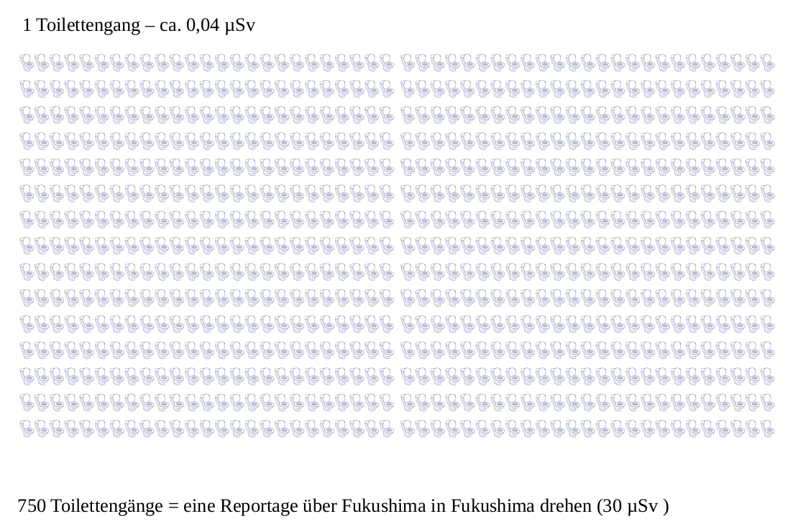

## Wiederholung Strahlendosis

- Welche Möglichkeiten der Messung radioaktiver Strahlung gibt es?
- Erstellen wir eine Tabelle

## Beispiel für Grafiken

[Größenverhältnisse](groessenverhältnisse.svg)

## Folgen einer Katastrophe

https://www.youtube.com/watch?v=aM_HbyIBbwc

## Update nach 10 Jahren

https://www.youtube.com/watch?v=lPWU5oICd00

### Aufgaben

1. Notieren Sie die Inhalte des Films, sodass Sie im Anschluss die einzelnen "Kapitel" zusammenfassen könnten.
2. Suchen Sie sich einen der genannten Messwerte zur Strahlendosis heraus. Stellen Sie die Größenverhältnisse ähnlich dar, wie oben gezeigt.

#### Ben

