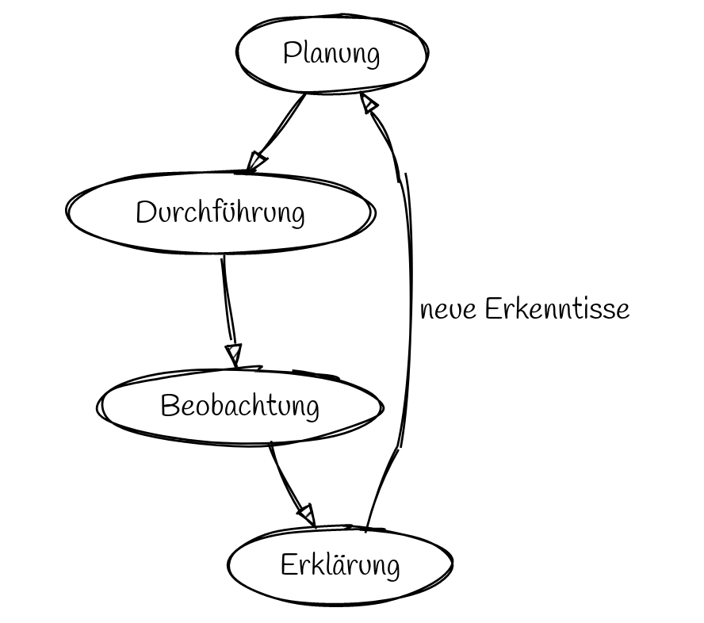

Charakteristische Denk- und Arbeitsweisen in der Physik
=================

## Planung von Experimenten zur Temperaturmessung

- Gleiche Mengen an gefrorenem Wasser und Raumtemperatur mischen
- Kaltes Wasser mit Kochsalz anreichern
- Wasser erhitzen
- Übergang von gefrorenem zu flüssigem Zustand
- ???

> Entwickeln Sie als zufällig zusammengestelltes Dreierteam ein Experiment und stellen Sie zu Beginn eine Zielformulierung auf.

## Protokolle als Medium der Kommunikation

[Anforderungen im Profilkurs](04_Protokolle_Experimente.md)

> Schlagen Sie einen Festlegung für einen angemessenen Umfang im PK vor.

