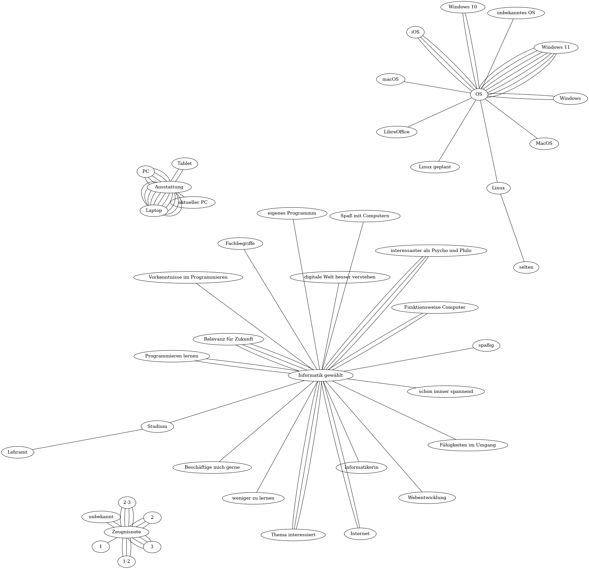

## Hausaufgabe

Schreiben Sie mir eine [E-Mail](mailto: baldauf.a@berlin.gcm.schule), in welcher Sie Ihre Gründe erläutern, weshalb Sie Informatikunterricht gewählt haben. Außerdem interessiert mich, mit welchem Computer und welchem Betriebssystem Sie zu Hause arbeiten. Schließlich möchte ich wissen, welche Schulnote Sie auf dem Zeugnis anstreben.

# Feedback der HA

## Verwendete Technologien

- Die Dot-Sprache bzw. Graphviz: https://graphviz.org/
- http://sketchviz.com (besonders auch die Hilfe checken)

~~~dot

# http://www.graphviz.org/content/cluster

graph G {

    layout=neato;
    overlap=false;

    Inf[label = "Informatik gewählt"]
    Aus[label="Ausstattung"]
    Zeu[label="Zeugnisnote"]

    # 00
    Inf -- "schon immer spannend"
    Aus -- "aktueller PC"
    OS -- "Windows 11"
    OS -- "Linux geplant"
    Zeu -- "3"

    # 01
    Inf -- "Thema interessiert"
    Inf -- "eigenes Programmm"
    Aus -- "Laptop"
    OS -- "Windows 11"
    Zeu -- "1-2"

    # 02
    Inf -- "Funktionsweise Computer"
    Aus -- "PC"
    OS -- "Windows 11"
    Zeu -- "unbekannt"

    # 03
    Inf -- "Relevanz für Zukunft"
    Aus -- "Laptop"
    OS -- "iOS"
    Zeu -- "1-2"

    # 04
    Inf -- "Beschäftige mich gerne"
    Aus -- "Laptop"
    OS -- "unbekanntes OS"
    Zeu -- "3"

    # 05
    Inf -- "Fähigkeiten im Umgang"
    Inf -- "weniger zu lernen"
    Aus -- "Laptop"
    OS -- "Windows 10"
    Zeu -- "2"

    # 06
    Inf -- "Funktionsweise Computer"
    Inf -- "Internet"
    Aus -- "PC"
    OS -- "Windows 11"
    Zeu -- "2"

    # 07
    Inf -- "Studium"
    Lehramt -- "Studium"
    Inf -- "Internet"
    Aus -- "PC"
    OS -- "LibreOffice"
    Zeu -- "2-3"

    # 08
    Inf -- "Thema interessiert"
    Aus -- "Laptop"
    OS -- "Windows 11"
    Zeu -- "3"

    # 09
    Inf -- "spaßig"
    Aus -- "Laptop"
    Aus -- "PC"
    OS -- "Windows"
    OS -- "Linux"
    selten -- "Linux"
    Zeu -- "2-3"

    # 10
    Inf -- "interessanter als Psycho und Philo"
    Aus -- "Laptop"
    OS -- "Windows 11"
    Zeu -- "2-3"

    # 11
    Inf -- "Spaß mit Computern"
    Inf -- "Informatikerin"
    Aus -- "Laptop"
    OS -- "Windows 10"
    Zeu -- "1-2"

    # 12
    Inf -- "Thema interessiert"
    Inf -- "Webentwicklung"
    Aus -- "Laptop"
    OS -- "Windows 11"
    Zeu -- "2-3"

    # 13
    Inf -- "interessanter als Psycho und Philo"
    Inf -- "Vorkenntnisse im Programmieren"
    Aus -- "Laptop"
    OS -- "Windows"
    Zeu -- "1"

    # 14
    Inf -- "Relevanz für Zukunft"
    Inf -- "Programmieren lernen"
    Inf -- "Fachbegriffe"
    Aus -- "PC"
    Aus -- "Tablet"
    OS -- "MacOS"
    OS -- "iOS"
    Zeu -- "2"

    # 15
    Inf -- "digitale Welt besser verstehen"
    Inf -- "Programmieren lernen"
    Aus -- "Laptop"
    OS -- "macOS"
    Zeu -- "unbekannt"

    # 16
    Inf -- "interessanter als Psycho und Philo"
    Inf -- "Relevanz für Zukunft"
    Aus -- "Tablet"
    OS -- "iOS"
    Zeu -- "3"
}
~~~
