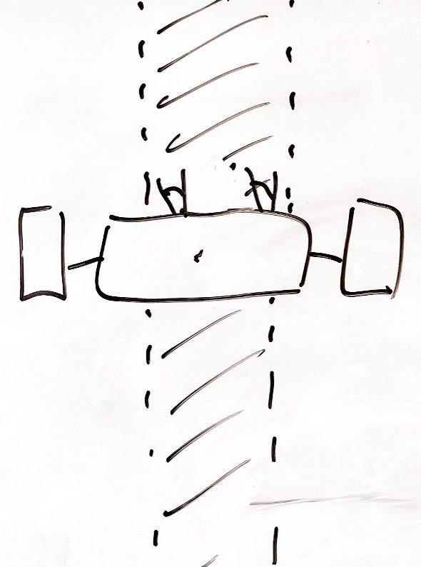

Programmablaufpläne (PAP)
===========

Allgemeine Infos: https://de.wikipedia.org/wiki/Programmablaufplan

Umgebung für komfortables Arbeiten: https://sketchviz.com/new

[PAP der Klasse 8](https://gcm.schule/material/2025/informatik/wpu8/3_programmablaufplan.md)

 a -> b -> c;
   c->d[label="true"];
   c->e[label="false"];
   d->c;
   e -> stop;
   a[label="lies n", shape=box];
   b[label="lies k", shape=box];
   c[label="k<n", shape=diamond];
   d[label="sag k ist kleiner", shape=box];
   e[label="sag k ist größer oder gleich", shape=box];
 }
'/>

> Aufgabe: Modellieren Sie das Addieren aller Zahlen von n bis k.

## Komplexere Aufgabe: Linienverfolgung

Ein Roboter hat zwei Motoren und zwei Sensoren, die jeweils links und rechts von der Mitte angeordnet sind.

Sie haben folgende Möglichkeiten zur Steuerung des Roboters:

- helligkeit_L() gibt die gemessene Helligkeit des Bodens als 8-Bit Integer zurück (0-255)
- helligkeit_R() gibt die gemessene Helligkeit des Bodens als 8-Bit Integer zurück (0-255)
- motor_L(power) setzt die Leistung des Motors auf einen Wert, z.B. power=1 für 100%, power=0.5 für 50%, usw.
- motor_R(power) setzt die Leistung des Motors auf einen Wert, z.B. power=1 für 100%, power=0.5 für 50%, usw.

> Erstellen Sie ein Programmablaufplan für das Verfolgen einer Linie auf dem Boden.

## Beginn einer Musterlösung

~~~dot
digraph G {
  graph [fontname = "Handlee"];
  node [fontname = "Handlee"];
  edge [fontname = "Handlee"];

  bgcolor=transparent;
  start -> b
  b[shape=Mdiamond label="h_L() = h_R()"];
  b-> c [label="yes"];
  b-> d [label="no"];
  d [lable="h_L() > h_R()", shape=diamond];
  c [shape=box, label="todo"];
  c-> end;
}
~~~
