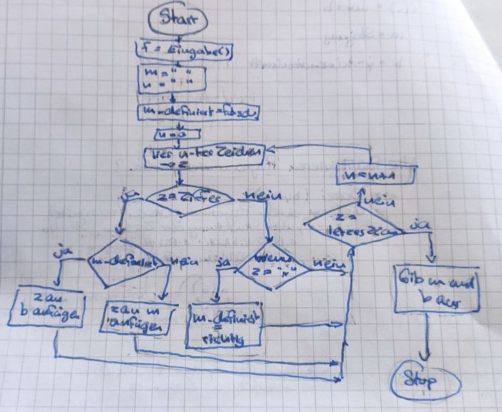
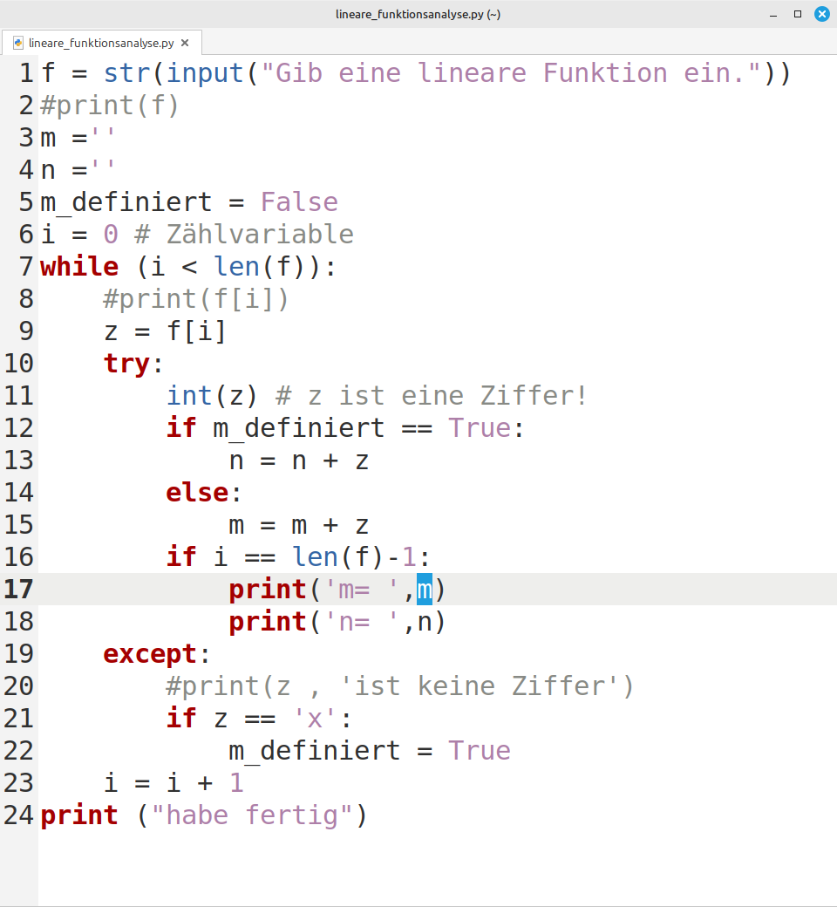
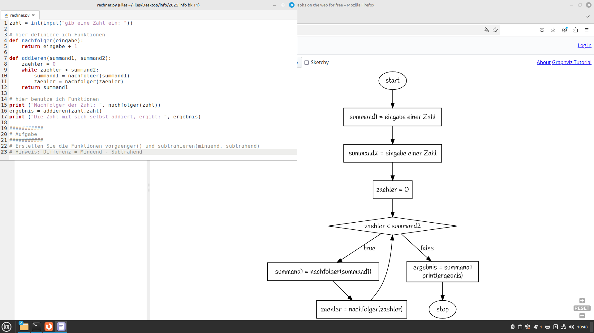
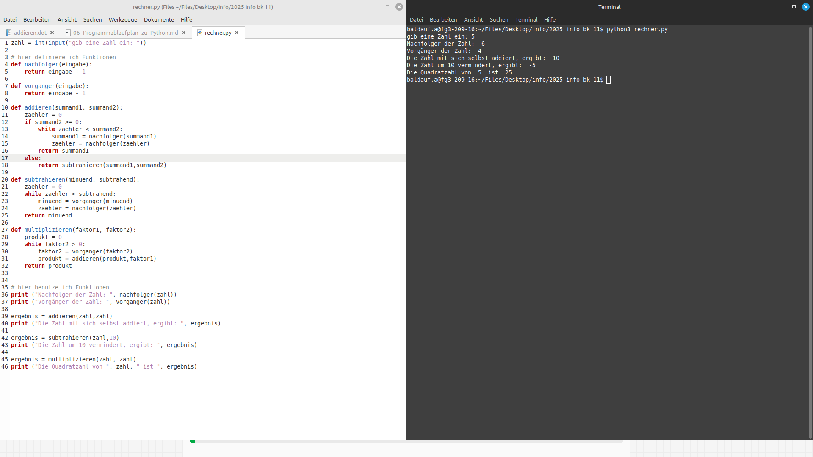
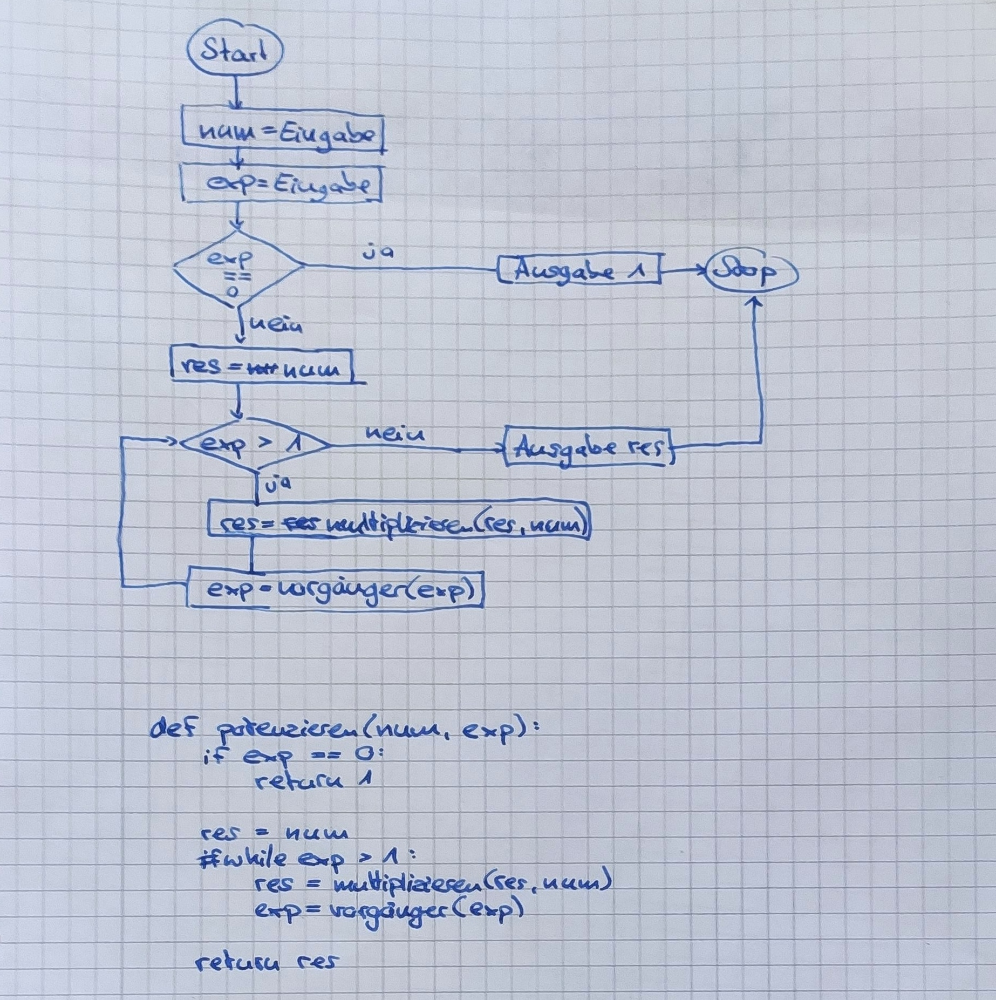

Programmablaufpläne (PAP)
===========

Allgemeine Infos: https://de.wikipedia.org/wiki/Programmablaufplan

Umgebung für komfortables Arbeiten: https://sketchviz.com/new

## Fakultät

1. Erstelle einen PAP zum Berechnen der Fakultät.
2. Überführe den PAP in python-Code

## Lineare Funktionen

1. Erstelle ein PAP, das zunächst nur die Struktur einer Eingabe verarbeitet und die Paramter m und n aus y = f(x) = mx+n in Variablen überführt.
1. Erstelle ein weiteres PAP, das zu einem x-Wert immer wieder einen y-Wert berechnet.
1. Wir überführen das wieder gemeinsam in ein Python-Programm.

### Musterlösungen

## Ein einfacher Rechner

Wir erstellen gemeinsam einen Rechner, der im Kern genauso funktioniert, wie Mathematik definiert ist. Wir beginnen mit der Addition und Subtraktion.

> Erstellen Sie die Funktionen vorgaenger() und subtrahieren(minuend, subtrahend) 
>
> Hinweis: Differenz = Minuend - Subtrahend

### Multiplikation

> Hausaufgabe: Beenden Sie Ihr PAP zur Multiplikation.

#### Musterlösung PAP

#### Aufgabe

> Ergänzen Sie Ihren Python-Code so, dass nun auch multipliziert werden kann.

#### Musterlösung Python

#### Klausurtraining

> $$f(x)=a^x$$
>
> z.B. $$5^3=5 \cdot 5 \cdot 5$$

1. Entwerfen Sie einen Programmablaufplan für das Potenzieren von Zahlen. Sie dürfen dafür nur folgende Operationen verwenden: addieren(sum1, sum2), multiplizieren(faktor, faktor2), nachfolger(zahl), vorgänger(zahl).
2. Überführen Sie IHREN Plan in Python-Code.

