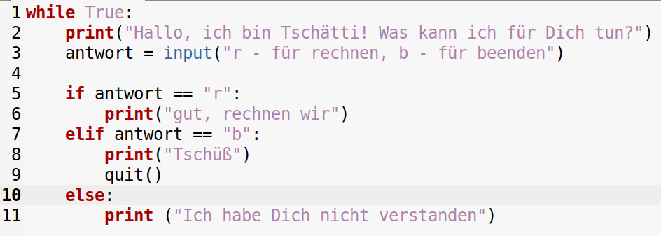

Chatbotprogrammierung in Python
===========

Vorbesprechung: Wir haben uns dafür entschieden, keinen Umweg über https://snap.berkeley.edu/ zu machen. Aber zum Selbststudium ist ein [Youtube-Tutorial](https://www.youtube.com/watch?v=kSLnwUuE3Xg) vielleicht hilfreich.

## Schritt 1: Verzweigungen und Endlosschleife

> Erstellen Sie einen mehr oder weniger witzigen Chatbot. Sie können dort gern andere Programme einbinden. Wie das geht sehen wir mit der Zeit.

Benutzen Sie dafür eine Endlosschleife, die die komplette Programmroutine ausführt. Verwenden Sie außerdem Verzweigungen, um die Eingaben der Benutzer zu verarbeiten.

### Musterlösung

## Schritt 2: Strukturierung von Code in Funktionen

Auf [dieser Seite](./rechner.md) befindet sich der Code des Rechners, allerdings ist der angepasst. Es wurde eine main-Funktion hinzugefügt. Diese main-Funktion wird nur dann ausgeführt, wenn man *rechner.py* als eigenständiges Programm ausführt. Wir werden aber diesen Rechner in unserem Chatbot verwenden.

### Verwendung von Funktionen aus anderen Programmen

Der Code des Chatbots wurde angepasst.

Mit der Zeile 1 haben wir die Datei "rechner.py" eingebunden. Dafür müssen beide Python-Dateien, also die Chatbot-Datei und die Rechner-Datei im gleichen Verzeichnis liegen.

In Zeile 12 können wir dann die Funktion addieren() benutzen.

> Ergänzen Sie die Fähigkeit Multiplikation auszuführen.

### Kommentieren

> Erstellen Sie Kommentare für jede Zeile Ihres Codes.

Hier ein Beispiel:

~~~python
import rechner # Es wird das Modul rechner geladen, das ist eine eigene Python-Datei rechner.py

while True: # Kopf einer Endlosschleife deren Bedingung immer "Wahr" ist
    print("Hallo, ich bin Tschätti! Was kann ich für Dich tun?") # Ein String wird durch die Print-Anweisung ausgegeben
    antwort = input("r - für rechnen, b - für beenden: ") #Ein String wird ausgegeben und damit um eine Eingabe gebeten, die als Wert der Variable antwort zugewiesen wird

    if antwort == "r": #Kopf einer Verzweigung mit der Bedingung, dass der Wert der Variable gleich dem String "r" ist
        print("Gut, rechnen wir.") # Ausgabe eines Strings - wie Zeile 4
        print("Als Erstes werden wir Zahlen addieren.") # wie Zeile 4
        sum1 = int(input("Gib den ersten Summanden an: ")) # wie Zeile 5, allerdings wird die Eingabe vor der Zuweiseung in ein Integer umgewandelt
        sum2 = int(input("Gib den zweiten Summanden an: ")) # wie Zeile 10
        summe = rechner.addieren(sum1, sum2) # Die Funktion addieren des externen Moduls rechner wir aufgerufen. Ihr werden zwei Variablen als Parameter übergeben
        print("Das Ergebnis ist ",summe) #wie Zeile 4, allerdings werden mehrere unterschiedliche Datentypen aneinander gereiht - der Wert von summe ist ein Integer
    elif antwort == "b": # Kopf des Alternativzweiges, wobei die Bedingung prüft, ob der Wert der Variable "antwort" gleich "b" ist
        print("Tschüß") # wie Zeile 4
        quit() # Mit dieser Anweisung wird das Programm beendet
    else: # Kopf des ultimativen Alternativzweigs (Standard-Zweig), falls alle Bedingungen unerfüllt sind
        print ("Ich habe Dich nicht verstanden") # Wie Zeile 4
~~~

### Einbettung von einem anderen Modul und ein neuer Datentyp

Auf [dieser Seite](./vokabeltrainer.md) finden Sie ein Unterprogramm, das einen einfachen Vokabeltrainer realisiert. 

> Binden Sie diesen Vokabeltrainer ein und verlängern Sie die Liste an Vokabeln um fünf weitere Elemente.

> Erläutern Sie die Funktionsweise von Listen. Sie finden die anschauliche Bearbeitung im Code des Vokabeltrainers.

### Zusatzaufgaben

> Ergänzen Sie den Vokabeltrainer um eine zusätzliche CSV-Datei, in der Sie als Spalten das jeweilige englische und deutsche Wort verwenden. Statt aus der Liste sollen die Vokabeln nun aus dieser CSV-Datei geladen werden.

**Für Programmier\*innen mit Superkraft:**

> Erstellen Sie ein Programm, dass Vokabeln aus einer Online-Quelle bezieht und in die CSV-Datei überführt.
