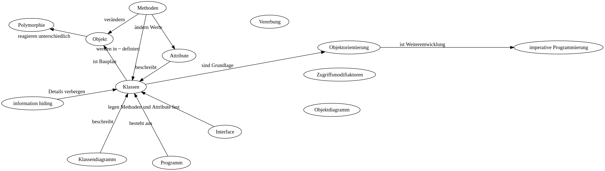

Einführung in die OOP
========================

> Aufgabe: Suchen Sie in verschiedenen Quellen Informationen über Objektorientierung zusammen.

<!--
digraph G {
 
 layout= circo;
 #layout= neato;
 overlap = "false";
 
 oo [label="Objektorientierung"];
 
 oo -> "imperative Programmierung" [label="ist Weiterentwicklung"];
 k [label="Klassen"];
 o [label="Objekt"];
 a [label="Attribute"];
 m [label="Methoden"];
 v [label="Vererbung"];
 z [label="Zugriffsmodifiaktoren"];
 ih [label="information hiding"];
 kd [label="Klassendiagramm"];
 od [label="Objektdiagramm"];
 p [label="Programm"];
 o -> Polymorphie [label="reagieren unterschiedlich"];
 Interface -> k [label="legen Methoden und Attribute fest"];
 kd -> k [label="beschreibt"];
 ih -> k [label="Details verbergen"];
 p -> k [label="besteht aus"];
 a -> k [label="beschreibt"];
 m -> k [label="werden in ~ definiert"];
 m -> o [label="verändern"];
 m -> a [label="ändern Werte"];
 k -> o [label="ist Bauplan"]
 k -> oo [label="sind Grundlage"]
}-->

> Hausaufgabe: Überführen Sie die Concept-Map zur Objektorientierung in einen Text, indem Sie alle Knoten und Kanten abarbeiten.

Tipps für gute Quellen:

- [OOP in PHP - ist einfach erklärt](https://www.php-einfach.de/experte/objektorientierte-programmierung-oop/)
- [OOP allgemeiner](https://www.ionos.de/digitalguide/websites/web-entwicklung/objektorientierte-programmierung-oop/)
- [OOP in python](https://www.python-kurs.eu/python_OOP.php)
