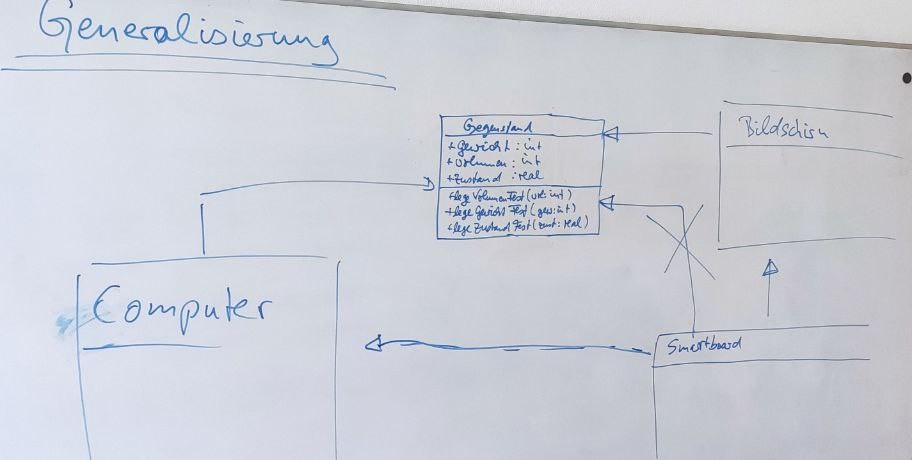

Generalisierung und Spezialisierung
========================

> Damals...

> Stellen Sie eine Definition für das Konzept der Generalisierung auf.

[Musterlösung](10_objektorientierung_definitionen.md)

Und dann geht das auch anders herum.

> ### Übung... analog zur Generalisierung
>
> Entwerfen Sie auf Basis des folgenden Textes Kindklassen von Smartboard, welche den Kriterien des folgenden Textes genügen.

~~~txt
Ein Smartboard kann sowohl an der Wand befestigt sein, als auch auf einem Wagen. 
Wenn es auf dem Wagen ist, gibt es Modelle mit Bremse und ohne. 
Es gibt auch mobile Smartboards, die elektrisch höhenverstellbar sind. 
Smartboards an der Wand haben zusätzlich noch Whiteboardflügel, die man auf- und zuklappen kann.
~~~

> Stellen Sie eine Definition für das Konzept der Spezialisierung auf.

[Musterlösung](10_objektorientierung_definitionen.md)

