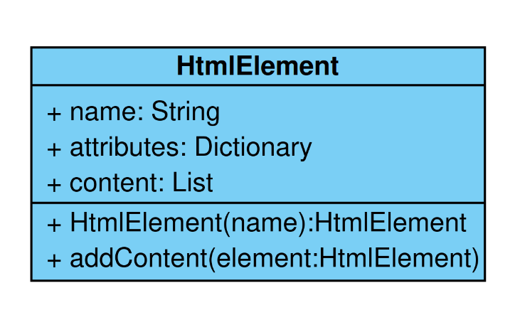

Konstruktor
====================

Ein Objekt, auch **Instanz** genannt, entsteht, wenn den Attributen einer Klasse Werte zugewiesen werden. Es ist quasi die "lebende" Klasse oder ein spezieller Vertreter einer allgemeinen Beschreibung. Den Prozess der Erstellung eines Objektes nennt man **Instanziierung**. Für diese Instanziierung gibt es eine spezielle Methode, die man **Konstruktor** nennt. Mit dem Konstruktor setzt man all jene Attribute, die gesetzt werden müssen, damit ein Objekt existieren kann.

> Legen Sie jeweils einen Konstruktor für die Klassen Ihres Klassendiagramms fest.

## Übungsaufgaben

> Überführen Sie das Klassendiagramm in Python-Code.

---

> Entwerfen Sie eine Methode mit der Sie Klassenvariablen setzen, die noch nicht gesetzt werden.

---

Eine HTML-Seite besteht aus einem Kopf und einem Körper. Der Kopf enthält eine Liste aus HTML-Elementen und der Körper auch eine solche Liste. Sie brauchen neben dem Konstruktor auch Methoden zum Hintufügen von HTML-Elementen zum Kopf und zum Körper.

---

> Entwerfen Sie für den Text ein Klassendiagramm und eine Python-Klasse.
