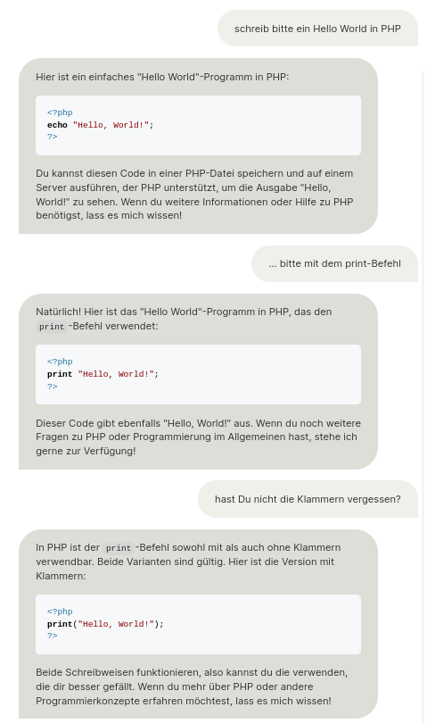

Wahlpflichtkurs Informatik 10
=========================

Diese Seite soll die Informationen, das Material und Aufgabenstellungen einiger Kurse zusammenfassen, die im aktuellen Schuljahr am GCM unterrichtet werden.

# 0. Stunde

* [Sie sind der Computer](https://compute-it.toxicode.fr/)

# 1. Stunde

* Grundlagen der Programmierung in PHP
    * Befehle
    * Funktionen
    * Variablen
* Spielfeld, bevor man einen eigenen Server betreibt: https://onlinephp.io/
* Handbuch, Hilfe und Informationen: https://php.net
* KI-Werkzeug mit dem einfache Programme erstellt werden können: https://www.ecosia.org/chat

* Weiterführung
    * Verzweigungen
    * Schleifen
* Erste Webseite (dieses Jahr)

~~~html
<!DOCTYPE html>
<html lang="de">
  <head>
    <meta charset="utf-8">
    <meta name="viewport" content="width=device-width, initial-scale=1.0">
    <title>Titel der Seite | Name der Website</title>
  </head>
  <body>
    <!-- Sichtbarer Dokumentinhalt im body -->
    
Sehen Sie sich den Quellcode dieser Seite an.
      <kbd>(Kontextmenu: Seitenquelltext anzeigen)</kbd>

  </body>
</html>

Kopiervorlage:

<!DOCTYPE html>
<html lang="de">
  <head>
    <meta charset="utf-8">
    <meta name="viewport" content="width=device-width, initial-scale=1.0">
    <title>Titel</title>
  </head>
  <body>

  </body>
</html>
~~~

# 2. Stunde (8.10.2024)

## Schleifen

> Wenn das und das passiert, machst Du das ganz oft hintereinander

- Kopf der Schleife: Lauf-Bedingung
- Körper der Schleife: Code der wiederholt wird

~~~php

// Endlosschleife

while(true){
    print("Hello World ");
}

// Zählschleife

$zaehler = 1;
while($zaehler <= 10){
    print("Ich bin bei: ".$zaehler." ");
    $zaehler++; //gleichwertig mit $zaehler = $zaehler + 1;
}
~~~

## Aufgabe

Erstelle eine Schleife, die 100x zu einem Startwert von 1 den jeweiligen Zählwert als Summe ausgibt. Der erwartete Output lautet also:

Summe: 1 
Summe: 3 
Summe: 6 
usw.

~~~php

$zaehler = 1;
$variable = 0;

while($zaehler(10) <= 100){
    $variable(55) = $variable(45) + $zaehler(10);
    print("Ich bin bei: ".45." ");
    $zaehler++; //gleichwertig mit $zaehler = $zaehler + 1;
}

~~~

# 3. Stunde (5.11.2024)

## Verzweigungen

> Firlefei

Erstellen Sie ein Programm, das in einem gegebenen String einen (jeden) Vokal gegen den String "firlefei" tauscht. Etwas lustig wird es, wenn eine Computersprache den Ergebnisstring vorliest...
