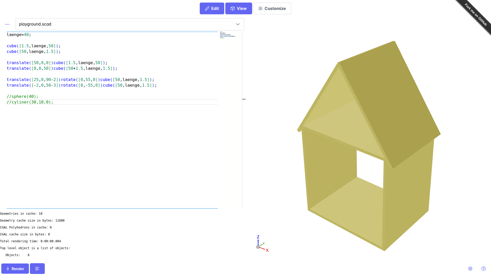

Kapitel 1 - Grundlagen
==============

# Hilfemöglichkeiten

- [Playlist auf gcmvideo](https://www.youtube.com/watch?v=iT_XUbgAiJY&list=PL0JavxASM3E0wbIQIrSi8fu1R6naFvHX0&index=1)
- [OpenScad Cheatsheet](https://openscad.org/cheatsheet/)
- [OpenScad Anleitung in englisch](https://openscad.org/documentation.html#tutorial)
- [Deutsches Tutorial in Schriftform]https://openscad-meistern.de/buch/

# Programme und Webseiten

- [Original Programm für alle Betriebssysteme](https://openscad.org/downloads.html)
- [OpenScad im Browser - mein Favorit](https://ochafik.com/openscad2/)
    - hat XYZ-Koordinatensysten
    - lädt Vorschau automatisch
- [OpenScad im Browser - dunkle Alternative](https://ochafik.com/openscad2/)
- [OpenScad für Android](https://www.scorchworks.com/ScorchCAD/scorchcad.html)
- [OpenScad für iPhone - ungetestet](https://apps.apple.com/de/app/modeler-3d/id1573983008)

# Erste Aufgabe

> Erstelle ein Programm, das ein Haus realisiert. Du darfst kreativ sein und Liebe zum Detail zeigen.

Wir führen ein:

- primive Objekte
- mathematische Operationen
- Variablen
- Bewegungen
- Rotationen
- Kommentare

## Musterlösung

> Bitte beachte: Diese Lösung ist nur ein Ansatz und zeigt nur die Grundlagen. Sei kreativ! Es fehlen: Fenster, Türen, Schornstein, Zimmer...

