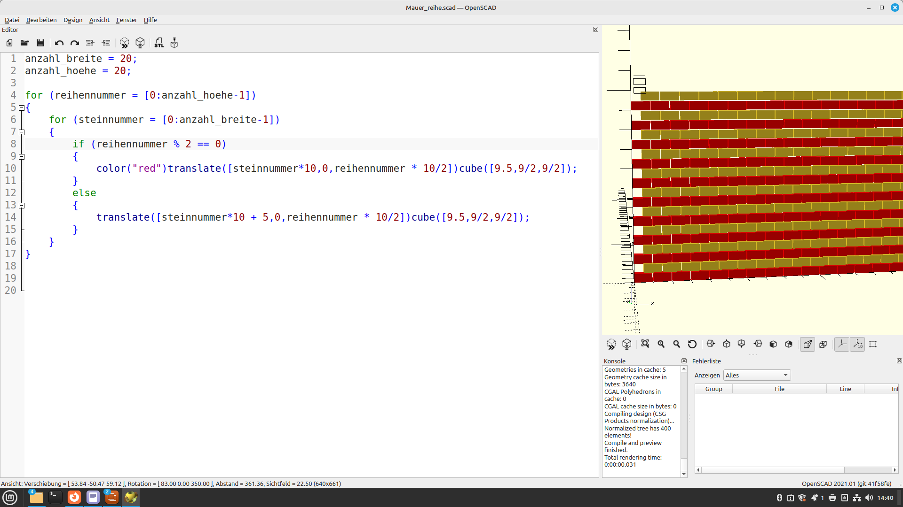
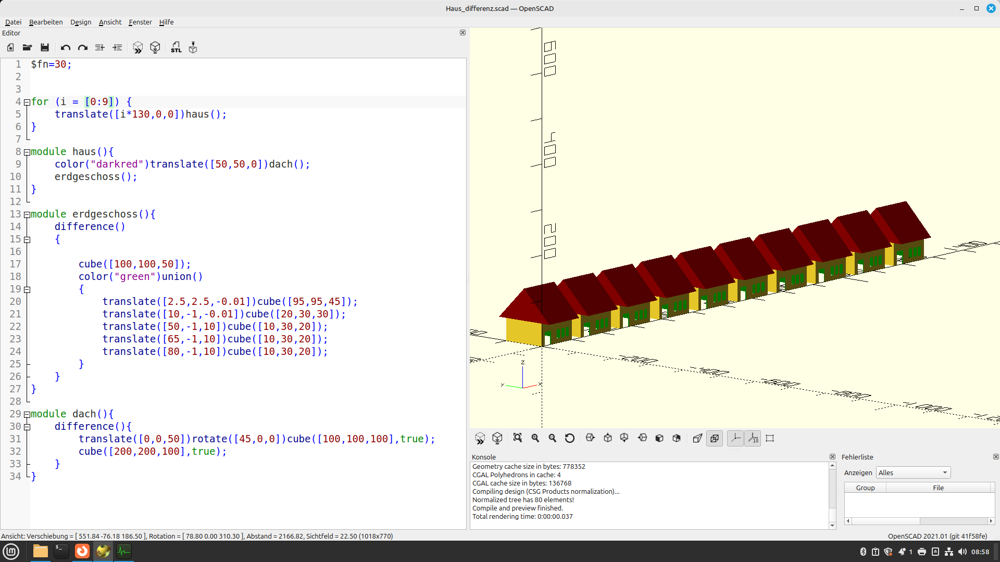

Kapitel 2 - Algorithmik
==============

[toc]

# Programmfluss-Kontrolle

Um Objekte nach von uns selbst festgelegten Regeln immer wieder platzieren zu können, bieten sich Schleifen und Verzweigungen aus der Programmierung an.

## Wir haben die Absicht, eine Mauer zu bauen

> Erstelle eine Reihe von Mauersteinen und aus einer Reihe gleich ganz viele übereinander.

## Musterlösung

**Hinweis**: Hier wird mit dem %-Zeichen die Modulo-Operation benutzt. Damit soll jede gerade Reihe von der jeweils ungeraden Reihe unterschieden werden. [Modulo gibt immer den ganzzahligen Rest bei der Division aus.](https://www.die-denkschule.ch/data/documents/Modulo-Teilen-mit-Rest.pdf) 

Beispiele:

- 1 % 2 = 5
- 2 % 2 = 0
- 100 % 2 = 0
- 101 % 2 = 5
- 1234567765432234567 = 5
- 1234567765432234568 = 0
- 0 % 3 = 0
- 1 % 3 = 1
- 2 % 3 = 2
- 3 % 3 = 0
- 4 % 3 = 1

## Mengenoperationen

> Mengenoperationen werden auch Boolsche Operationen genannt. Sie dienen dazu verschiedene einfache Objekte zu kombinieren. Man kann sie zusammenfügen (union). Man kann Objekte voneinander subtrahieren oder "herausschneiden" (difference). Oder man kann, das ist am Schwersten zu verstehen, nur die Überschneidungen von Objekten verwenden (intersection).

### difference

~~~
difference()
{
    cube(12, center=true); 
    sphere(8);
}
~~~

~~~ 
difference()
{
    sphere(8); 
    cube(12, center=true);
}
~~~

### union

~~~
union()
{
    cube(12, center=true);
    sphere(8);
}
~~~

### intersection

~~~
intersection(){
    cube(12, center=true);
    sphere(8);
}
~~~

## Module

