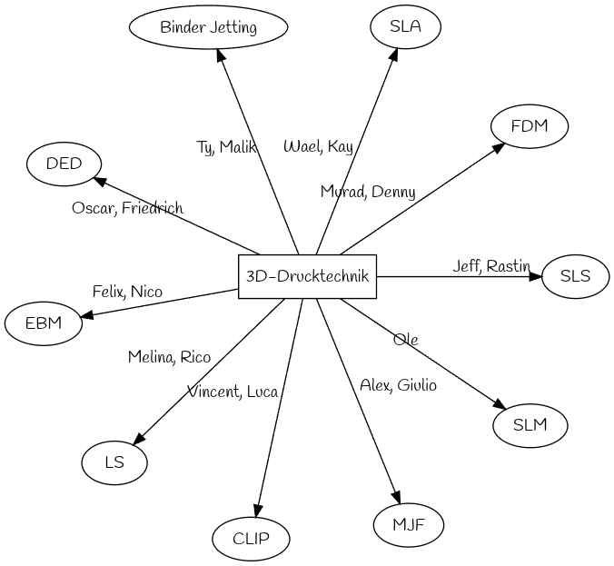

Kapitel 3 - 3D-Drucktechnik
==============

# Verschiedene 3D-Druckverfahren

> Erstelle zusammen mit einem Partner oder einer Partnerin einen Vortrag über 3D-Druckverfahren.

## Umfang

- Name erklären
- Funktionsprinzip erläutern
    - Pflicht: Eigene Skizze
- Geräte(e) in Form von Bilde(rn) zeigen
- Druckerzeugnisse vorstellen
- Kosten aufzeigen
    - Kosten für Druckerzeugnisse
    - Kosten für einen 3D-Drucker

## Zuteilung der Verfahren zu den Verantwortlichen

