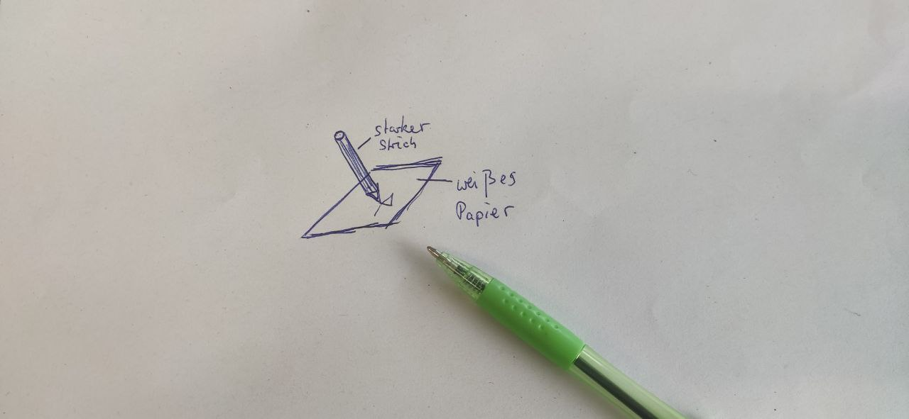
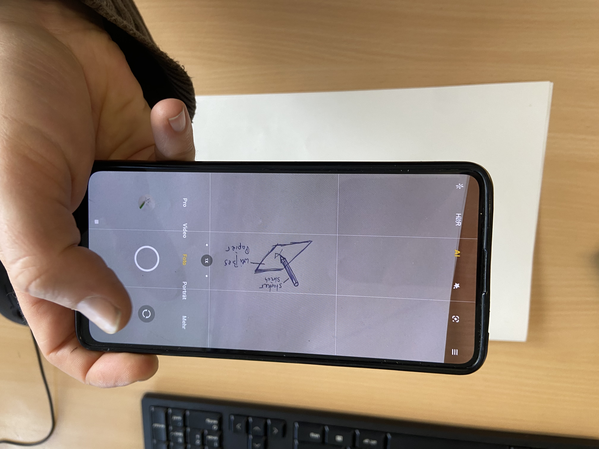
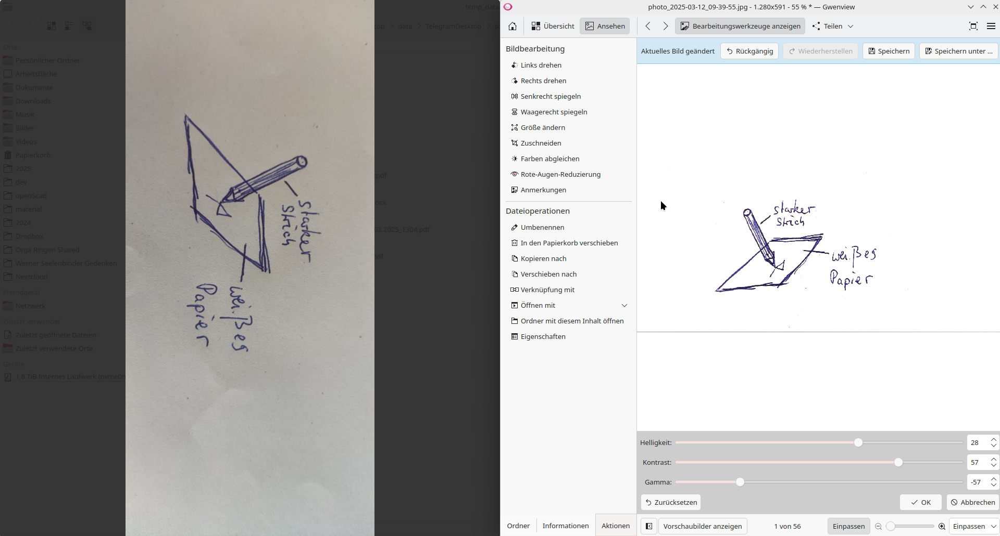
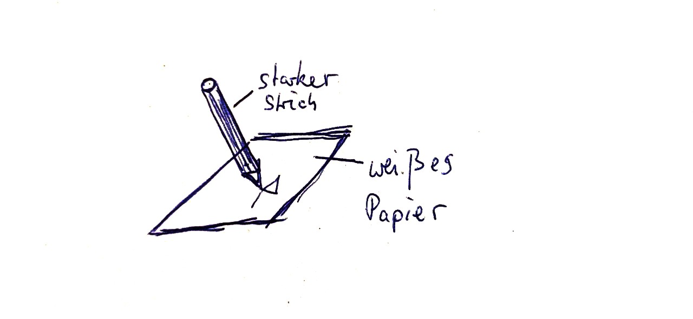
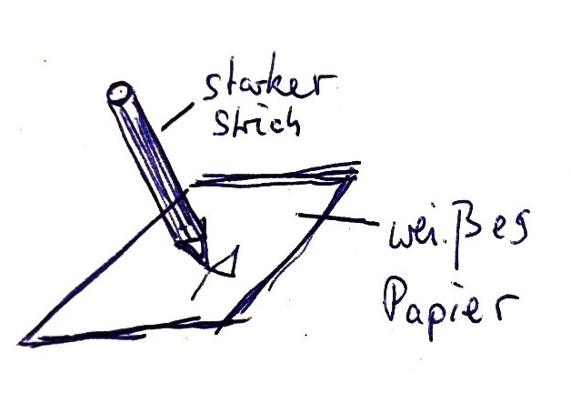
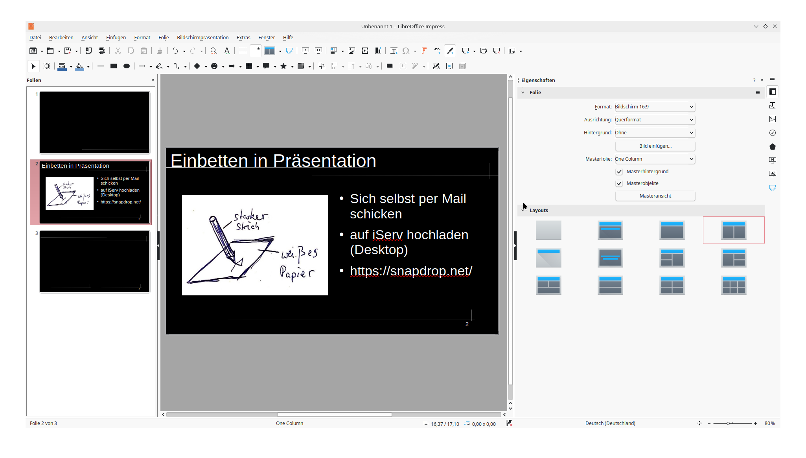

Kapitel 3 - 3D-Drucktechnik
==============

> Eigene Skizze in Präsentationen einbinden

---

# Schritt 1: Skizze erstellen

---

# Schritt 2: Skizze abfotografieren

---

# Schritt 3: Kontrast und Helligkeit erhöhen

---

---

# Schritt 4: Zuschneiden

---

# Schritt 5: Einbetten

> Für LibreOffice Impress

---

---

# Schritt 5: Einbetten für GCM-Slides

https://youtu.be/G9b501I_rjs?si=gE8NOc2DydTB4x94
