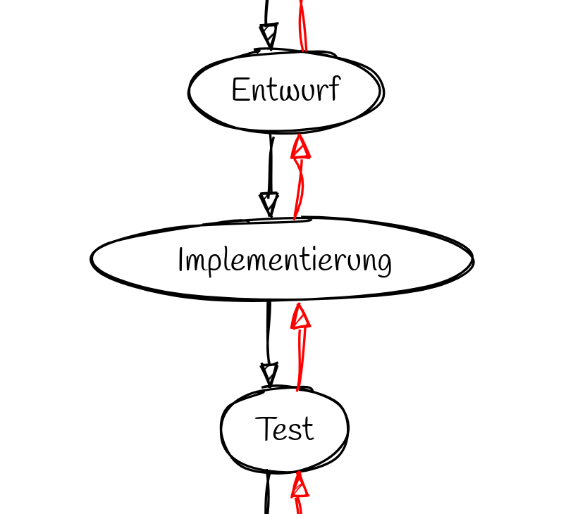

# Wasserfallmodell

> sequentiell (mehr oder weniger strikt)

> seit den 50er Jahren 

> ursprünglich in Bau und Produktion

> einfach, weit verbreitet

---

## Beispielgrafik aus dem Netz

> 6 Phasen, andere Namen

> frühe Phasen kommen oft zu kurz

---

---

## Initialisierung

- Problembeschreibung
- Projektziele
- Grobe Projektbeschreibung
- Grober Projektplan
- Kostenabschätzung
- Angebot an den Kunden

---

## Konzept

- Wünsche des Kunden 
    - auswerten
    - aufschreiben (Papier) 
- am Ende: Pflichtenheft

Plichtenheft: Daten und deren Zusammenhänge verbal beschrieben (semantisches Datenmodell)

---

## Entwurf

- eigentliche Entwicklung
- Ergebnis: Programmspezifikation
	- alle **Einzelheiten** beschrieben

> div. Technologien: Je einfacher, desto besser

---

## Implementierung

**Entwurf** ==(Programmierung)=>> **Programm**

**Entwurf** ==(Konstruktion)=>> **Prototyp**

---

## Test

- zwei Arten
	- Programmtest: Teile auf logische Konsistenz
	- Benutzertest: unter Produktionsbedingungen durch ausgesuchte Benutzer
---

## Installation

- Bei Software: Installationsroutine
- Sonst: Einbau, Aufbau beim Kunden

> Auslieferung

---

## Wartung

- Anwenderschulungen
- Beseitigen von weiteren Fehlern
- Programmerweiterungen

---

## Rückkopplung

> Sinnvoll eine Phase zu wiederholen?

- falsche Annahmen
- neue Erkenntnisse
- unrealistische Planung
- fehlende Kompetenz
- zu wenig Geld

---

## Rückkopplung

> Sinnvoll eine Phase zu wiederholen?

---

---

## Auffällig für Software-Projekte

| Phase | Anteil | Programmieren |
|---|---| ---|
| Initialisierung | 0,14 | nein |
| Konzept | 0,14 | nein |
| Entwurf | 0,14 | nein (vielleicht) |
| Implementierung | 0,14 | **ja** |
| Test | 0,14 | nein (teilweise) |
| Installation | 0,14 | nein (teilweise) |
| Wartung | 0,14 | nein (teilweise) |

---

# Quelle

- https://wiki.ibkastl.de/view/Wasserfallmodell
- https://www.scnsoft.de/blog-pictures/softwareentwicklung/modelle-der-softwareentwicklung/1-wasserfall-.png

alle abgerufen: 02.04.2025

---

# Grafiken

... gerendert mit https://sketchviz.com/

~~~dot
Initialisierung -> Konzept -> Entwurf -> Implementierung -> Test -> Installation -> Wartung
Wartung -> Installation -> Test -> Implementierung -> Entwurf -> Konzept -> Initialisierung [color=red]
~~~
