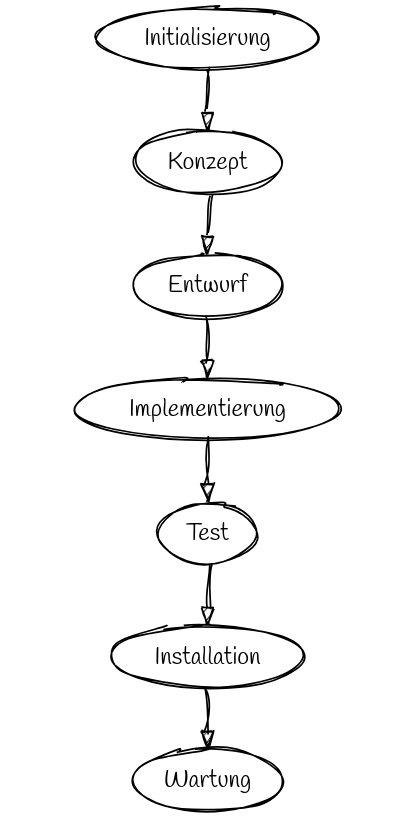
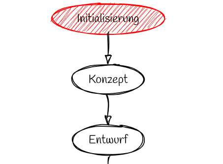
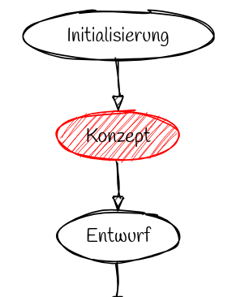
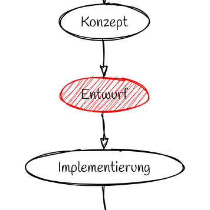
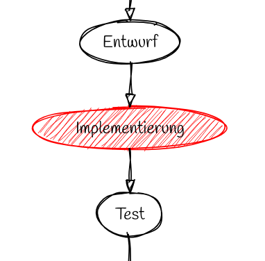
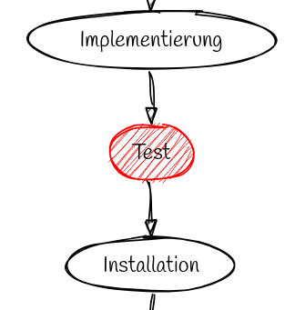
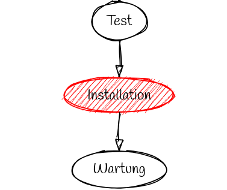
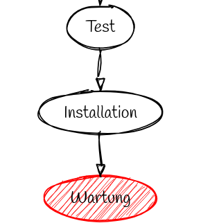
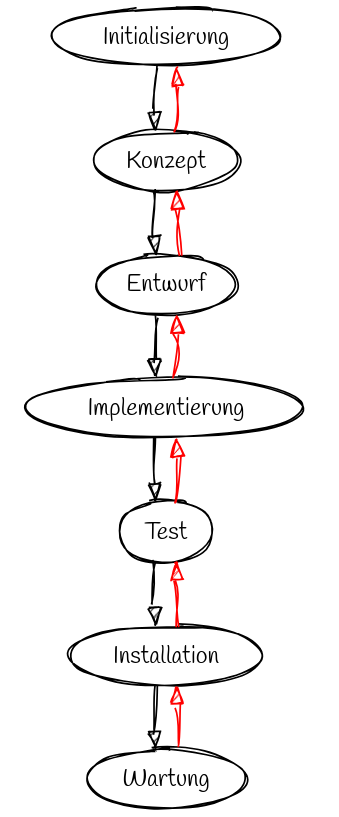

# Wasserfallmodell

> sequentiell

> seit den 50er Jahren

> 

---

---

---

## Initialisierung

- Problembeschreibung
- Projektziele
- Grobe Projektbeschreibung
- Grober Projektplan
- Kostenabschätzung
- Angebot an den Kunden

---

## Konzept

- Wünsche des Kunden systemanalytisch ausgewerten
- aufschreiben (Papier) 
- am Ende: Pflichtenheft

Plichtenheft: Daten und deren Zusammenhänge verbal beschrieben, (semantisches Datenmodell)

---

## Entwurf

- auch Feinkonzept gennant 
- eigentliche Entwicklung
- Ergebnis: Programmspezifikation
	- alle Einzelheiten beschrieben

---

## Implementierung

Entwurf => Computerprogramm 

---

## Test

- zwei Arten von Tests
	- Programmtest: Teile auf logische Konsistenz
	- Benutzertest: unter Produktionsbedingungen durch ausgesuchte Benutzer
---

## Installation

- Bei Software: Installationsroutine
- Sonst: Einbau, Aufbau beim Kunden

> Auslieferung

---

## Wartung

- Anwenderschulungen
- Beseitigen von weiteren Fehlern
- Programmerweiterungen

---

## Feedback

---

## Auffällig

Für Software-Projekte

| Phase | Anteil | Programmieren
|---|---| ---|
| Initialisierung | 0,14 | nein |
| Konzept | 0,14 | nein |
| Entwurf | 0,14 | vielleich |
| Implementierung | 0,14 | ja |
| Test | 0,14 | teilweise |
| Installation | 0,14 | teilweise |
| Wartung | 0,14 | teilweise |

---

# Quelle

https://wiki.ibkastl.de/view/Wasserfallmodell

02.04.2025
