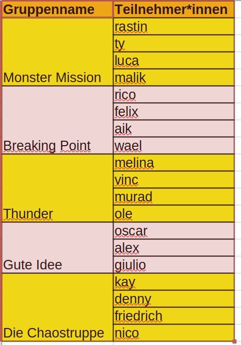

Projektseite
===============

[toc]

## Zyklus 0

1. Gruppenbildung
1. Risikoanalyse
1. Präsentation und Austausch unter den Gruppen
1. Planung des ersten Zyklus
    - Was wird das Ziel sein?
    - Besuch der LG1 und Befragung
    - Ausformulierung der Fragen
    - Arena?

### Teams

> Jeff: Gute Idee

### Risiken

1. Faulheit
1. Teamprobleme: Jeder hat eine andere Meinung, Einzelne wollen sich durchsetzen, es kommt zu Streit
1. Der Kreisel könnte zerbrechen
1. Teure Materialien
1. Probleme werden zu spät bemerkt (man hat schon das Projekt fast fertig)
1. Kreisel funktioniert nicht
1. Verletzungsgefahr
1. Drucker funktioniert nicht
1. Altersunangemessene Arbeitsergebnisse
1. Anforderungen der LG1 werden nicht gut verstanden
1. Umsetzung dauert zu lange ist unmöglich
1. Fehler beim Zusammenbau
1. Kreisel springt aus Arena
1. Kreisel bleibt hängen
1. Zusammenarbeit im Team funktioniert nicht
1. Entwicklungssystem funktioniert nicht richtig

### Maßnahmen zur Reduktion oder dem Eindämmen der Risiken

1. Beteiligung, Arbeit, Gute Laune, Einbeziehung der Teammitglieder, Verantwortlichkeit
1. Jeder hat eine Aufgabe und ist auch in der Lage, diese zu erfüllen, Probieren sich zu einigen, Ideen sammeln, jeder entwirft Modelle, Vergleich innerhalb der Teams, Kompromisse eingehen, Abstimmungen
1. Design verbessern, kleben/verschmelzen, Bruchstellen verstärken - testen & ausprobieren, anderes Material verwenden, besseres Filament wählen, dichter drucken, hält der Kreisel den Start aus, Extreme probieren
1. günstige Materialien verwenden, Material teilen, gebrauchtes Material verwenden, ausleihen, recycling, Rabatte nutzen, Budget erhöhen, Fördergelder beantragen, Geld nicht verschwenden - sparen, Filamentpresse (Fehldrucke recyclen), Sponsoren suchen
1. Teile neu machen, einfach Probleme früher bemerken, Teile einzeln prüfen und testen, immer mehrere Teile drucken, modulares System aus mehreren Teilen zusammenbauen

> Vervollständigung als HA - Zusammenarbeit im Team ist erwünscht

## Zyklus 1

1. Namensfindung
1. Analyse bestehender Kreisel-Systeme
    - > Ergebnis: Bezeichnung der Einzelteile und Funktion dieser Teile
    - > Vorgabe: Je Gruppenmitglied ein Teil definieren
1. Formulierung von Design-Anforderungen
    - Jedes einzelne Gruppenmitglied formuliert für ein Teil Anforderunen an das Design
    - Wenn Gruppenmitglieder fehlen (oder die Arbeit verweigern), muss die Gruppe das ausgleichen

### SalzH

> Zyklus 1 muss bis zu dieser Stelle abgeschlossen sein.

#### Erwartetes Arbeitsergebnis

- pro Schüler des Kurses: 1 Mail mit
    - Bezeichnung des Teils für das man selbst verantwortlich ist
    - drei Anforderungen an das Design des einzelnen Teils am Ende der Seite sind Funktionen von Design aufgelistet und erläutert. Deine Anforderungen können diese Funktionen ganz spezifisch beschreiben.
- pro Gruppe:
    - eine Tabelle der folgenden Form (beispielhaft - die Anforderungstypen können variieren)

| Anforderungstyp | Teil A (Verantwortlich) | Teil B (Verantwortlich) | Teil C (Verantwortlich) | Teil D (Verantwortlich) |
|---|---|---|---|---|
|Ästhetik | | | | |
|Funktionalität | | | | |
|Kommunikation | | | | |

### Wenn wir uns wiedersehen

1. Austausch der Ergebnisse
1. Risikoanalyse der Design-Anforderungen anderer Gruppen
1. Feedbackrunde
1. Planung des nächsten Zyklus

## Zyklus 2

1. Skizzen erstellen
    - mindestens so viele Teile, wie Personen
1. Skizzen vorstellen
1. Risikoanalyse durch andere Gruppe
1. Feedbackrunde
1. Schlussfolgerungen aus Risikoanalyse

## Zyklus 3

1. Erste 3D-Modelle erstellen

todo

# Breaking Point

- Chip (faceplate) :teil zum zusammenhalt des beyblades
- weight : beschwerung des beyblades
- ring : kontaktstellen aus plastik oder gummi  für angriffe
- disk : mittelteil des beyblades (größte gewicht quelle)
- tip (spitze) : teil des beyblades damit er sich drehen kann 

| Anforderungstyp | Teil "Chip" (Aik) | Teil "Ring" (Aik) | Teil "Gewicht" (Felix) | Teil "Spitze" (Rico) |
|---|---|---|---|---|
|Ästhetik |Gesicht des Kreisels schön aussehen, kräftig aussehen | | nicht wichtig | muss zum Kreisel passen|
|Funktionalität | hält Kreisel zusammen | ist angriffsfläche | Gleichgewicht, kein Umkippen | Geschwindigkeit und Last aufnehmen |
|Kommunikation | Alle zerstören | Alle zerstören | Alle zerstören | Alle zerstören |

# Monster Mission

- Spitze: sorgt für wenig Bodenreibung, dass er sich drehen kann
- Laufspur: Hält die Spitze
- Angriffsscheibe: Ballerst die anderen Kreisel weg
- Bolzen: Fixiert die Angriffsscheibe, Anschluss für Akkubohrer

| Anforderungstyp | Teil A (Rastin) | Teil B (Malik) | Teil "Disc" (Ty) | Teil D (Luca) |
|---|---|---|---|---|
|Ästhetik | | | Disc Für Gewicht und Balance des beyblades muss aber auch cool aussehen.| |
|Funktionalität | | | Muss schwer sein um den beyblade in balence zu halten das er nicht so leicht umfällt.| |
|Kommunikation | | |JAJAJAJAJAJAJA | |

# Thunder

> keine Ergebnisse

| Anforderungstyp | Teil A (Verantwortlich) | Teil B (Verantwortlich) | Teil C (Verantwortlich) | Teil D (Verantwortlich) |
|---|---|---|---|---|
|Ästhetik | | | | |
|Funktionalität | | | | |
|Kommunikation | | | | |

# Gute Idee

## Beschreibung einer KI (Was ist ein Beyblade?)

Ein Beyblade ist ein rotierender Kreisel aus Kunststoff und Metall, der für ein Spielzeugkampfspiel entwickelt wurde. Das System stammt ursprünglich aus Japan und wurde von Takara Tomy eingeführt. Ein Beyblade besteht typischerweise aus drei Hauptkomponenten (je nach Generation variabel):

- Ebene 1: Energy Layer (Angriffsschicht) – beeinflusst das Kontaktverhalten
- Forge Disc (Metallscheibe) – reguliert Gewicht und Stabilität
- Performance Tip (Spitze) – bestimmt das Bewegungsmuster

| Anforderungstyp | Teil A (Verantwortlich) | Teil B (Verantwortlich) | Teil C (Verantwortlich) | Teil D (Verantwortlich) |
|---|---|---|---|---|
|Ästhetik | | | | |
|Funktionalität | | | | |
|Kommunikation | | | | |

# Die Chaostruppe

- dem Attack Ring: soll schaden machen
- der Weight Disk: soll Gewicht hinzufügen, um mehr kinetische Energie zu haben
- der Blade Base (Spitze): Drehung und Interaktion verantwortlich
- ???

| Anforderungstyp | Teil A (Verantwortlich) | Teil B (Verantwortlich) | Teil C (Verantwortlich) | Teil D (Verantwortlich) |
|---|---|---|---|---|
|Ästhetik | | | | |
|Funktionalität | | | | |
|Kommunikation | | | | |

# Funktionen von Design (KI-generiert)

Design erfüllt eine Vielzahl von Funktionen, die in verschiedenen Bereichen Anwendung finden. Hier sind einige der wichtigsten Funktionen von Design:

    Ästhetik: Design schafft visuelle Anziehungskraft und Schönheit, die das Benutzererlebnis verbessern.

    Funktionalität: Ein gutes Design sorgt dafür, dass Produkte und Dienstleistungen benutzerfreundlich sind und ihre Funktion effektiv erfüllen.

    Kommunikation: Design vermittelt Informationen und Botschaften klar und verständlich, sei es durch Grafikdesign, Webdesign oder Produktdesign.

    Identität: Design hilft, Markenidentität und -wahrnehmung zu schaffen, indem es ein einheitliches visuelles Erscheinungsbild fördert.

    Innovation: Durch kreatives Design können neue Ideen und Lösungen entwickelt werden, die Probleme lösen oder Bedürfnisse erfüllen.

    Nachhaltigkeit: In vielen modernen Designs wird auch Wert auf Nachhaltigkeit gelegt, indem umweltfreundliche Materialien und Prozesse berücksichtigt werden.

