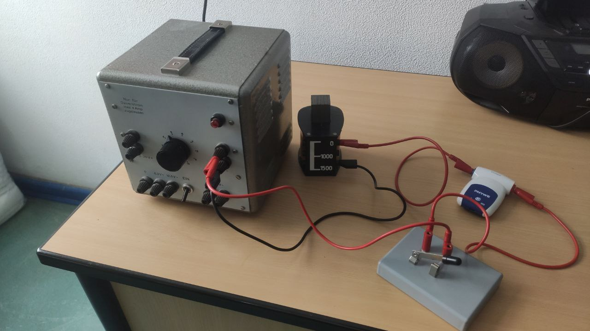
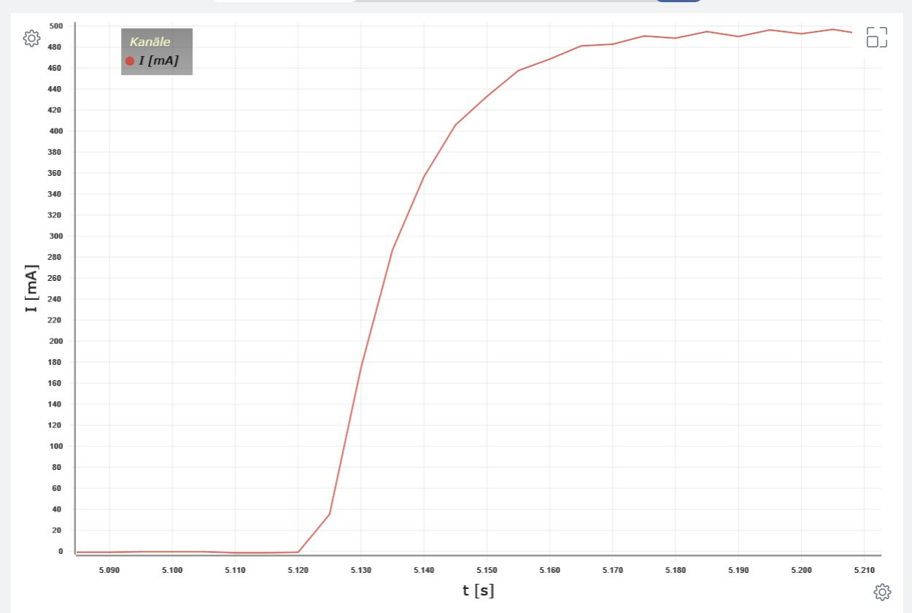
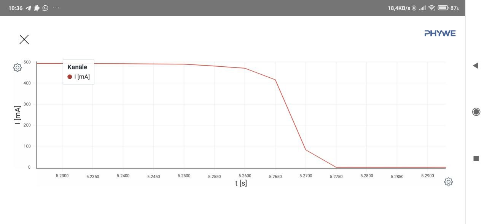

## Energie des Magnetfeldes

- Formel erarbeiten
- Skizzen

### Selbstinduktion

https://www.youtube.com/watch?v=TVtH5atUP7Y

#### Experiment

> Skizzieren Sie den Versuchsaufbau.
>
> Übertragen Sie den vereinfachten Kurvenverlauf in Ihre Aufzeichnungen.
>
> Beschreiben Sie den Kurvenverlauf.
>
> Erklären Sie den Kurvenverlauf.

### Induktivität

https://www.leifiphysik.de/elektrizitaetslehre/elektromagnetische-induktion/grundwissen/selbstinduktion-und-induktivitaet

> Skizzen erstellen, Tafelbild, Aufgabe

### Erarbeitung

https://www.leifiphysik.de/elektrizitaetslehre/elektromagnetische-induktion/grundwissen/energie-des-magnetischen-feldes

> Skizzen erstellen, Tafelbild, Aufgabe

