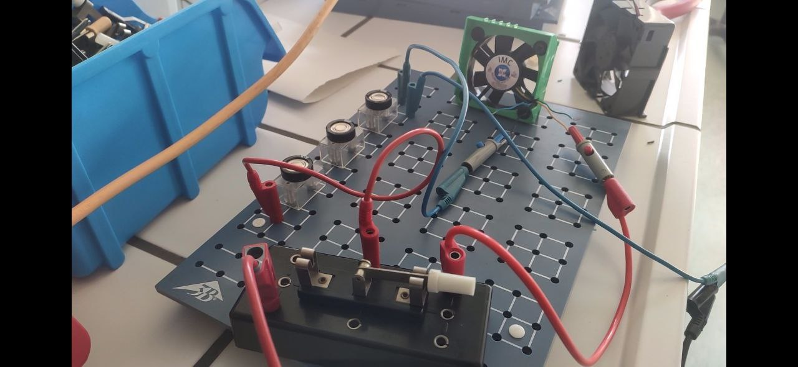

Kondensatoren
======================

> Kondensatoren, die für maximal 5,5V ausgelegt sind, haben eine Kapazität von 1F. Kombinieren Sie eine minimale Anzahl an Kondensatoren so, dass ein Energiespeicher entsteht, der mit 12V geladen werden kann.

## Kapazität

Für die Kapazität gilt: $C = {{Q}\over{U}}$  und  $C = \epsilon_o \epsilon_r {{A}\over{d}}$

Für Reihenschaltungen von n Kondensatoren gilt: $U=U_{1} + ... + U_{n}$ und ${{1}\over{C_{Ges}}} = {{1}\over{C_1}} + ... + {{1}\over{C_n}}$

Für Parallelschaltungen von n Kondensatoren gilt: $U = U_1 = ... = U_n$ und $C_{Ges} = C_1 + ... + C_n$

## Energie

$E = {{1}\over{2}} C U^2$

> Ermitteln Sie die theoretische Dauer mit der ein 12V, 0,12A Lüfter betrieben werden kann.

> HA: Erstellen Sie einen Schaltplan für einen Energiespeicher, der mindestens für 60s reicht.

## Entladung eines Kondensators

### Experiment "12V-Lüfter"

- Erstellen Sie einen Schaltplan von dem Aufbau.
- Notieren Sie Ihre Beobachtungen während der Versuchsdurchführung.
- Formulieren Sie Ihre Beobachtungen in ganzen Sätzen.

In beiden Durchführungen wurde der Kondensator ungefähr gleich lang geladen. Beim ersten mal drehte sich der Ventilator allerdings nur kurze Zeit. Beim zweiten mal drehte er sich deutlich länger. Jedes mal drehte sich der Ventilator zunächst schnell, dann immer langsamer.

- Stellen Sie eine Vermutung auf, weshalb sich das Beobachtete so ereignet hat.

Irgendwas mit Restladung...
Beim ersten Versuchsteil drehte sich der Lüfter nur kurz, es blieb aber Ladung im Kondensator
Beim zweiten Laden war schon Energie im Kondensator gespeichert und am Ende war insgesamt mehr Energie im Kondensator, als beim ersten Versuch.

- So konnte beim zweiten Durchlauf der Kondensator längere Zeit laufen

### Experiment "Spannungs-Entladekurve eines Kondensators"

- Bauen Sie die (gegebene) Schaltung auf und lassen Sie diese genehmigen.
- Erstellen Sie mit dem [Messwerterfassungssystem](https://www.phywe.de/sensoren-software/mess-software-apps/measureapp-die-kostenlose-mess-software-fuer-alle-endgeraete_2274_3205/) ein U(t)-Diagramm für 10µF und 47Ω.
- Bringen Sie den Kurvenverlauf in Zusammenhang mit dem Verhalten des Lüfters.

## Herleitung Energie im Kondensator (06.12.24)

Vollziehen Sie die Herleitung der Energie im Kondensator in Ihrem Hefter nach. 

Quelle: **Lehrbuch S II** S. 152ff

Ausblick: Herleitung mit Ansatz 

$$
W =  \int_{0}^{Q} U(q) dq 
$$

## Energie im Kondensator ist nicht Energie des Teilchens

LBS. 154: Feldenergie wird in kinetische Energie umgewandelt

LBS. 156: Herleitung der Ablenkung nachvollziehen und präsentieren

LBS. 160 Nr. 16

Blick ins Tafelwerk

## Elektronenstrahlröhren

https://www.youtube.com/watch?v=2rTqOzKRAAo

https://www.youtube.com/watch?v=roS0IxWtq0Q

https://www.youtube.com/watch?v=JHv2TBMRr8s
