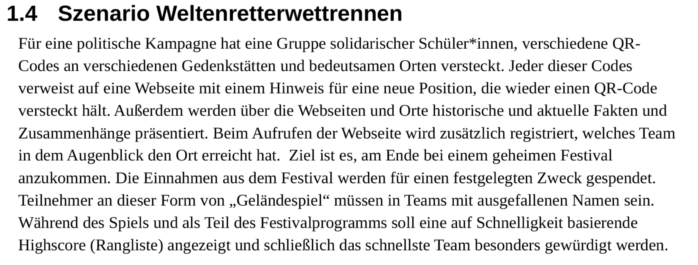
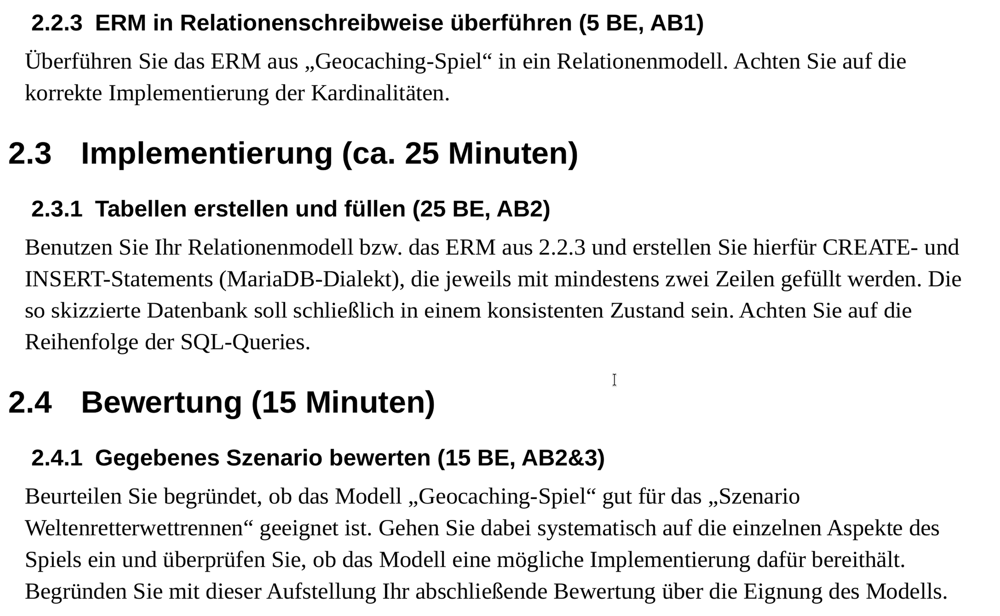

Entity-Relationship-Modelle
==========

> Da wir von administrativen Aufgaben unterbrochen wurden, gibt es die [Mitschriften](03_ERM_Tafelanschrieb.pdf) ausnahmsweise. Diese beinhalten insbesondere die Anleitung zur Überführung von ERM in RM.

### Aufgaben

> Erfüllen Sie nur die Klausuraufgaben, die sie erfüllen können, also 2.2.3 und 2.4.1 !

