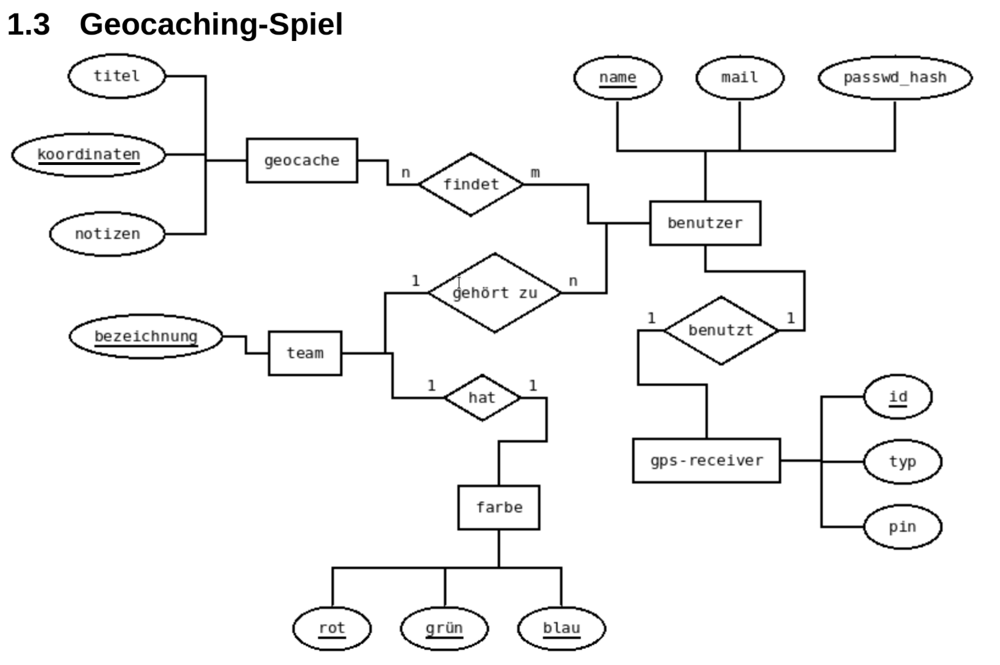

Entity-Relationship-Modelle
==========

> Da wir von administrativen Aufgaben unterbrochen wurden, gibt es die [Mitschriften](03_ERM_Tafelanschrieb.pdf) ausnahmsweise. Diese beinhalten insbesondere die Anleitung zur Überführung von ERM in RM.

### Aufgaben

