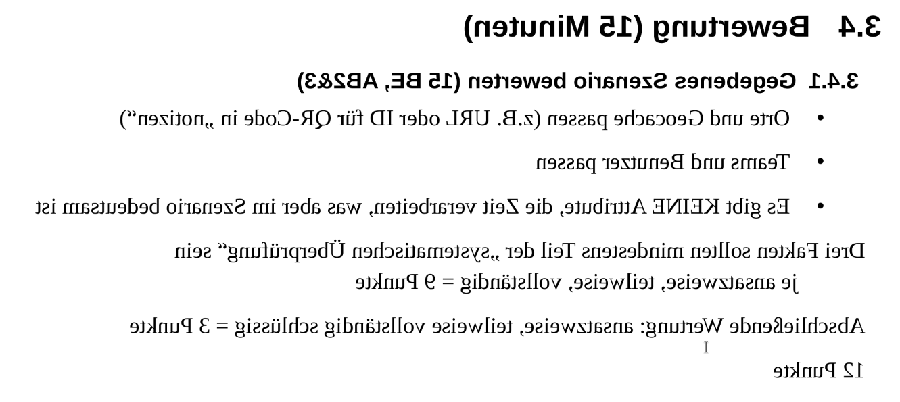
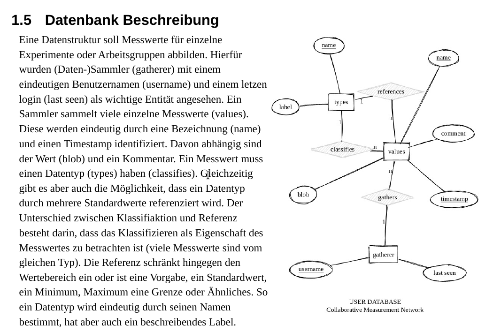

Klausurvorbereitung
==========

## Kopie aus der ERM-Aufgaben

> Erfüllen Sie nur die Klausuraufgaben, die sie erfüllen können, also 2.2.3 und 2.4.1 !

#### Aus dem Erwartungshorizont

## Nulltestundeaufgabe: Erstellen Sie ein ERM für Ihr Szenario

> Beurteilen Sie, ob das von Ihrem Mitschüler präsentierte ERM für sein zuvor vorgestelltes Szenarion geeignet ist.

Tipps:

- Gehen Sie nach Kriterien vor: Überprüfen Sie, ob alle Entitäten, Attribute und Beziehung vorhanden sind. Stellen Sie Überlegungen an, ob die verwendeten Kardinalitäten geeignet sind, die Zusammenhänge zu modellieren. Fassen Sie dann ihre Erkenntnisse, also Ihr begründetes Urteil auf Basis ihrer systematischen Untersuchung zusammen.

## Weitere Übungsaufgaben

1. Vergleichen Sie das oben gezeigte ERM mit dem ERM auf der Projektseite für das "Colaborative Measurement Network" (https://github.com/gruener-campus-malchow/colamator) und beschreiben Sie die Unterschiede.
1. Überführen Sie das ERM von oben in ein RM und außerdem in Tabellen mit je 3 Beispielwerten.
1. Lesen Sie den Abschnitt "Ziele" auf der [Projektseite von colamator] und beurteilen Sie, ob das dort vorgestellte ERM geeignet ist, die Ziele zu erfüllen.
1. Modellieren Sie ein ERM, welches möglich macht, dass einzelne Messwerte öffentlich oder privat sind.

## Transparenzdokument

> Comming soon.
