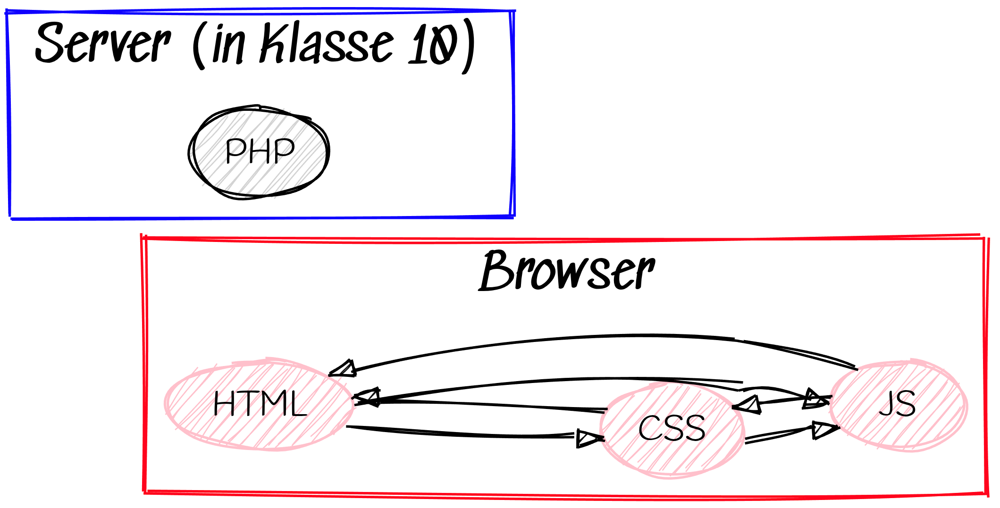

WPU 9 Informatik
===========

# Orga

> Wir sehen uns nur noch zwei Stunden pro Woche!

## Belehrungen

* [Regeln im NAWI-Fachraum](../../Fachraumordnung_und_Experimentierregeln_SuS.pdf)
* [Regeln im Computerraum](../../Regeln_Computerraum_2025-09-10.pdf)
* [Unterschriften](../../Unterschriftenliste_Sicherheitsunterweisung_GCM_SuS.pdf)

## Wichtige Tools

# Webentwicklung

> Dritte jetzt neue Technologie: JavaScript

## Aufgaben

1. Lies den Artikel über die Rollen der drei Technologien auf [selfhtml](https://wiki.selfhtml.org/wiki/HTML/Tutorials/Trennung_von_Inhalt,_Pr%C3%A4sentation_und_Verhalten)
1. Fertige eine Tabelle an, die nach folgendem Schema funktioniert:

|Abkürzung|richtiger Name|Nutzen und Zweck|
|---|---|---|
|HTML| | |
|CSS| | |
|JS| | |

# JavaScript

Das ist eine vollwertige Programmiersprache!

## Aufgaben (als Code along)

1. Erstelle mit KI eine freundliche Webseite, die auch schick aussieht.
1. Binde drei Bilder ein, die alle relativ klein dargestellt werden.
1. Ergänze JS-Code mit dem man die Größe verändert, sobald man mit dem Mauszeiger darüber schwebt.

### Code Snippets

#### HTML-Datei
~~~html
<!DOCTYPE html>
<html lang="de">
  <head>
    <meta charset="utf-8">
    <meta name="viewport" content="width=device-width, initial-scale=1.0">
    
    <title>Test</title>
    
  </head>
  <body>
    
  </body>
</html>

~~~

#### JS-Datei
~~~JavaScript
'use strict';

document.addEventListener('DOMContentLoaded', function ()
{
    alert("Ich heiße dich herzlich Willkommen!");
    document.getElementById('bild1').addEventListener('pointerover', zoom1_in);
    document.getElementById('bild1').addEventListener('pointerleave', zoom1_out);

});

function zoom1_in()
{
    var dasBild1 = document.getElementById('bild1');
    dasBild1.style.width = "400px";
}

function zoom1_out()
{
    var dasBild1 = document.getElementById('bild1');
    dasBild1.style.width = "200px";
}

~~~

[Teste den Code](01_test.html)
