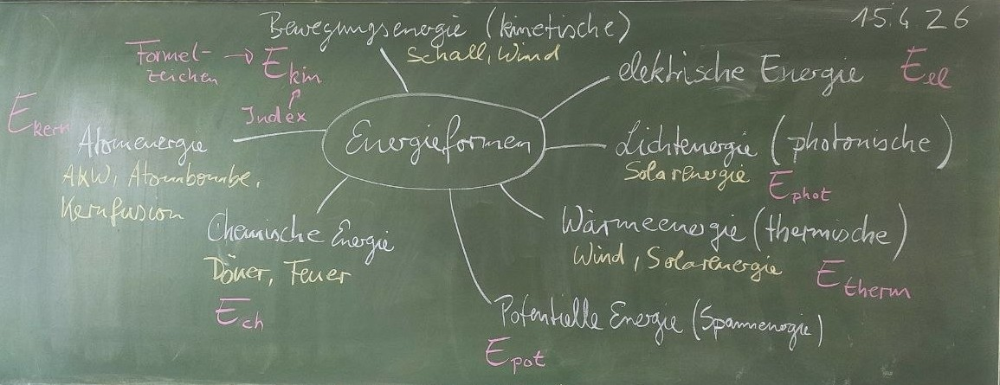

Energie
==========

## Energieformen

## 

<!--

- Energieerhaltung -> siehe AB
    - Übung: Falsche Schemata erkennen und den Fehler benennen
- Energieumwandlungen
- Immer wieder die Kompetenzen aus Atomphysik aufgreifen
- Wirkungsgrad

https://www.faszination-rohstoffe.de/uploads/media/1200x/05/325-Heimische-Braunkohle.webp?v=1-0

https://www.morgenpost.de/brandenburg-aktuell/article125882975/Stillgelegte-Kohlebergwerke-gefaehrden-Frankfurt-Oder.html

http://www.maerkische-schweiz.de/pages/region/sehenswuerdig/naturdenkmaeler/schwarzekehle.html

https://www.destatis.de/DE/Themen/Branchen-Unternehmen/Energie/Erzeugung/_inhalt.html

https://heise.cloudimg.io/v7/_www-heise-de_/imgs/18/2/5/7/6/8/9/8/ch.1318.006-023.neu2.qxp_group_4006-ef9595f595499778.jpg?force_format=avif%2Cwebp%2Cjpeg&org_if_sml=1&q=70&width=1019
https://www.heise.de/select/make/2018/7/1542081113640669/contentimages/pek.Stromerzeugung.mbr_IG.jpg

-->
