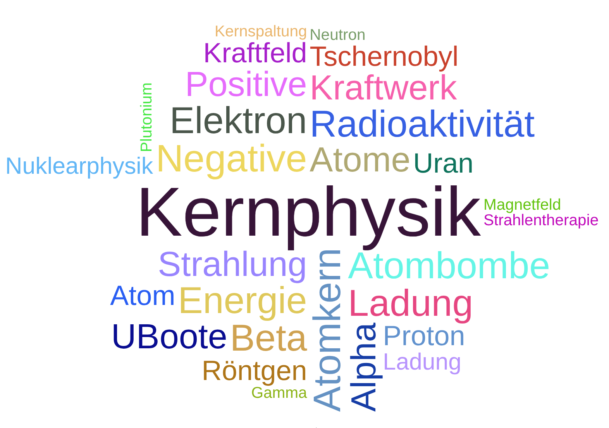

Physik 10b
==============

# Kernphysik

- Wortwolke erstellen https://www.wortwolke24.de/
- Sortieren:
    - Was wurde behandelt?
    - Was ist interessant?
    - Was ihr dazu noch lernen sollt.

## Atommodelle

> Zeitdruck: Was auch immer die Leute sich (vorher) vorgestellt haben: Bohrsches Atommodell

- Video: Offline
- Aufgabe: Zufällige Dreiergruppen erstellen eine Skizze von einem Atommodell.
    - Ranking A: phyikalische Korrektheit
    - Ranking B: Ästhetik
    - Ranking C: Meinung der SuS

> Wir haben den Aufbau von Atomen für ein paar Beispiele gezeigt.
    
### Atom Aufbau 

SimpleClub: https://www.youtube.com/watch?v=BqeSHBgIRWI

> Erstellen wir eine Mitschrift!
    
### Hülle

- Hülle: Chemie
- Hülle: Licht, Röntgenstrahlung

### Atomkern

> - Im Kern steckt viel Masse
> - Im Kern steckt viel Energie

#### Probelauf Physikübung: Geht das mit der Klasse?

- Freiwillige
- 1/3 SuS sind Hülle
- 1/3 SuS sind Protonen, 1/3 SuS sind Neutronen
    - Entweder: Spontaner Zerfall
    - Oder: Störung von außen

Radioaktive Strahlung: https://www.youtube.com/watch?v=rHUJMVDOMtM

> Erstellen wir eine Mitschrift!

<!--

Lagerung: https://www.youtube.com/watch?v=h7G4-WgAPJk

Argumente: https://www.youtube.com/watch?v=7oP2Cx-ssOc

-->
