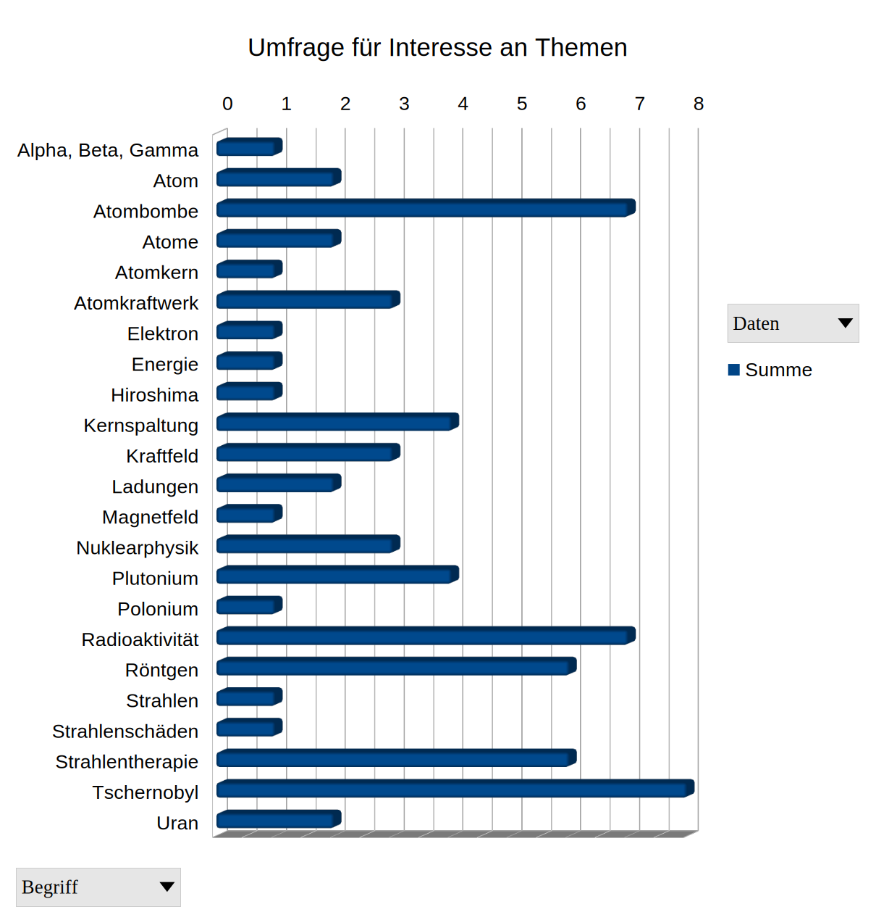

Physik 10b
==============

~~~
2.10.2025
~~~

# Kernphysik

- Wortwolke erstellen https://www.wortwolke24.de/
- Sortieren:
    - Was wurde behandelt?
    - Was ist interessant?
    - Was ihr dazu noch lernen sollt.

## Erste Sammlung an Begriffen, die man schon einmal gehört hat
    

## Gewichtung der Interessen aus einer Umfrage

## Atommodelle

> Zeitdruck: Was auch immer die Leute sich (vorher) vorgestellt haben: Bohrsches Atommodell

- Video: Offline
- Aufgabe: Zufällige Dreiergruppen erstellen eine Skizze von einem Atommodell.
    - Ranking A: phyikalische Korrektheit
    - Ranking B: Ästhetik
    - Ranking C: Meinung der SuS

> Wir haben den Aufbau von Atomen für ein paar Beispiele gezeigt.

---
~~~
9.10.2025
~~~

- Eine kleine Geschichte vom PSE
- Ein Spiel für alle, die gerne [mit Atomen spielen](https://phet.colorado.edu/sims/html/build-an-atom/latest/build-an-atom_all.html?locale=de)
    
### Atom Aufbau 

SimpleClub: https://www.youtube.com/watch?v=BqeSHBgIRWI

> Erstellen wir eine Mitschrift!
    
### Hülle

- Hülle: Chemie
- Hülle: Licht, Röntgenstrahlung

### Atomkern

> - Im Kern steckt viel Masse
> - Im Kern steckt viel Energie

#### Probelauf Physikübung: Geht das mit der Klasse?

- Freiwillige
- 1/3 SuS sind Hülle
- 1/3 SuS sind Protonen, 1/3 SuS sind Neutronen
    - Entweder: Spontaner Zerfall
    - Oder: Störung von außen

Radioaktive Strahlung: https://www.youtube.com/watch?v=rHUJMVDOMtM

> Erstellen wir eine Mitschrift!

### Isotope

- Formelsammlung: https://gcm.schule/formelsammlung.pdf
- Nuklidkarte1: https://www.egwoerth.de/images/Faecher/Physik/Physik_Nuklidkarte_EGW.pdf
- Nuklidkarte2: https://physiklehrer.net/Nuklidkarte/

#### Schreibweisen

- Massenzahl, Kernladungszahl

### Radioaktive Teilchen

> Übung: Benutzen Sie die Formelsammlung auf S. 71,72 und 73
>
> Nennen Sie die Ordnungszahl **und** Halbwertszeit von: Bi210, Pt198, Rn225, O13 und C14

- **Noch einmal:** Radioaktive Strahlung: https://www.youtube.com/watch?v=rHUJMVDOMtM
- Alpha-, Beta-, Gammastrahlen
- Auch Kernstrahlung aber nicht ionisierend: Neutronenstrahlung (wichtig für das Verständnis von Atomkraftwerken)
- Röntgenstrahlung (X-Strahlen) stammt nicht aus dem Kern, deshalb nicht radioaktiv aber ionisierend
- Lehrbuchseite 129
- Zerfallsgleichung
- Zerfallsketten

> Test: Nuklidkarte, ~~Zerfallsgleichung~~

### Die Uran-238-Reihe

> Vollziehe die Reihe fünf Schritte lang nach.

#### Man kann auch zurück rechnen: [Transurane](https://de.wikipedia.org/wiki/Transurane)

"Alle bekannten Transurane sind radioaktiv mit Halbwertszeiten zwischen einigen 10 Millionen Jahren (selten, z. B. Plutonium-244) über Minuten bis zu Bruchteilen einer Sekunde (häufig). Einige Isotope der leichteren Transurane von Neptunium bis Curium haben Halbwertszeiten von einigen Jahrmillionen, Jahrtausenden oder Jahrhunderten. Sie entstehen in Kernreaktoren und machen einen Teil der langlebigen radioaktiven Abfälle aus.

Im Periodensystem der Elemente beginnt nach dem Uran mit der Ordnungszahl 92 die Reihe der Transurane mit dem Neptunium (Element 93). Neben dem für die Kernspaltung bedeutenden Element Plutonium (94) gehören auch Americium (95), Curium (96), Berkelium (97), Californium (98), Einsteinium (99), Fermium (100), Mendelevium (101), Nobelium (102) und Lawrencium (103) sowie alle weiteren schwereren Elemente (Transactinoide) zu den Transuranen."

https://www.astropage.eu/2021/05/19/radioaktives-plutonium-244-und-ein-umdenken-bei-der-nukleosynthese/

### Im Kernreaktor beim Verbrennen

Bevor wir weiter machen:

### Halbwertszeit

> Notiere die Halbwertszeiten folgender Elemente in Deinen Hefter:
> - Neptunium
> - Plutonium
> - Americium
> - Curium

Halbwertszeit verstehen: https://www.mintjanssen.de/web-apps/wuerfelzerfall/

~~~
Am Anfang werden 150 Würfel geworfen. Alle Würfel, die danach eine Sechs zeigen, 
werden rot markiert und gelten als zerfallen. Sie können nun gezählt werden.

Die Würfel entsprechen also in diesem Modellexperiment radioaktive Atomkerne.

Vor dem nächsten Wurf werden sie automatisch aussortiert.

Ein Wurf entspricht einem Zeitschritt in der Realität.

Ein Würfel ist gelb mit schwarzen Augen gefärbt. 
Davon abgesehen besitzt er keine besonderen Eigenschaften. 
Es kann interessant sein, zu notieren, nach welchem Wurf, bzw. zu welchem Zeitpunkt er zerfallen ist. 
Lässt sich eine Regelmäßigkeit feststellen? 
~~~
Quelle: https://www.mintjanssen.de/web-apps/wuerfelzerfall.html#start

|Vorgang|Zeit|
|---|---|
| Spielen | 3 Minuten |
| Erkläre Deinem Nachbarn, was bei dem Experiment geschieht. Erkläre insbesondere, weshalb der Zufall eine wichtige Rolle spielt. | 2 x 1 Minute |
| Erstelle eine Tabelle in der Du für jeden Wurf die Anzahl aller noch vorhanden Würfel notierst (siehe unten) | 5 Minuten |
| Stelle die Tabelle grafisch dar. (x-Achse für die Wurfnummer, y-Achse für die Anzahl der Würfel) | 5 Minuten |

> Vergleiche Deine eigene Grafik mit folgender Grafik. Was fällt Dir auf?
>
> Tipps:
> - Beschreibe den Kurvenverlauf
> - Wie beginnt die Kurve
> - Welche Unterschiede gibt es?

> Bestimme die Halbwertszeit des Würfelexperimentes.

Und nun der schwierige Teil:

> 1. Entwirf eine Definition für den Begriff "Halbwertszeit".
> 1. Tausche Deine Definition mit jemanden, der nicht in unmittelbarer Nähe sitzt.
> 1. Ergänze die fremde Definition mit kurzen Hilfen oder einem Lob.
> 1. Finden wir im Anschluss einen Konsens?

#### Aufgaben

1. Die erste wägbare Menge von Plutonium-239, etwa 4 μg, wurde im August/September 1942 von Burris B. Cunningham, M. Cefola und Louis B. Werner isoliert. Wenn man diese Menge 200'000 Jahre lagern würde. Wieviel wäre ungefähr noch vorhanden?
1. In einem Kernreaktor wurde 1g des Transurans Americium-238 hergestellt. 
    - Stelle den Zerfall in einem Graphen dar. 
    - Erläutere anhand des Graphen, weshalb 24h später kaum noch Spuren davon zu finden waren.
    - Ermittle aus der Isotopenkarte, welches Isotop stattdessen vorhanden war.

### Apropos Lagerung

https://www.youtube.com/watch?v=h7G4-WgAPJk

#### Aufgaben

- Übernimm folgende Tabelle in Deinen Hefter und vervollständige sie:

| Halbwertszeit | Aktivität | Risiko unmittelbar | Risiko langfristig |
|---|---|---|---|
| gering | | | |
| |gering | | |

- Eigenschaften radioaktiver ionisierender Strahlung (Quelle: [Leifi](https://www.leifiphysik.de/kern-teilchenphysik/radioaktivitaet-einfuehrung/grundwissen/ueberblick-ueber-die-strahlungsarten))

|Stahlungsart|Teilchen oder Welle|Reichweite|Abschirmbarkeit|Ionisierungsvermögen|Vorgang im Kern |
|---|---|---|---|---|---|
|alpha | | | | | | 
|beta | | | | | | 
|gamma| | | | | | 

- Beurteile unter welchen Bedingungen Du radioaktive Stoffe zu Hause (in Deinem Zimmer) lagern würdest - oder weshalb nicht.
- Beurteile unter welchen Bedingungen Du an einem Ort mit radioaktiven Stoffen, z.B. einem Labor, arbeiten würdest.

# Nutzung der Kernenergie: Kernspaltung

## Kettenreaktionen

Ansprechend von einem Energiekonzern moderiert: https://www.youtube.com/watch?v=jpDRfaWYk3I

Kettenreaktion spielerisch: https://phet.colorado.edu/de/simulations/nuclear-fission

> Erstelle eine Skizze, aus welcher die Funktionsweise von Zerfallswärmebetriebenen Dampfmaschinen (aka Atomkraftwerke) hervorgeht.

## Funktionsweise eines AKW beschreiben

- Exkurs in die Geschichte: Plutoniumproduktion in Windscale
- Vollständige Doku (1h28min) https://www.youtube.com/watch?v=x_pWgRx7lno

## Größen zur Beschreibung radioaktiver Strahlung

- Aktivität ([Leifi](https://www.leifiphysik.de/kern-teilchenphysik/radioaktivitaet-fortfuehrung/grundwissen/zerfallsgesetz-zerfallskonstante-und-halbwertszeit))
- Energiedosis ([Lernhelfer](https://www.lernhelfer.de/schuelerlexikon/physik/artikel/energiedosis))
- Äquivalentdosis ([Lernhelfer](https://www.lernhelfer.de/schuelerlexikon/physik/artikel/aequivalentdosis))
- Halbwertszeit ([Leifi](https://www.leifiphysik.de/kern-teilchenphysik/radioaktivitaet-fortfuehrung/grundwissen/zerfallsgesetz-zerfallskonstante-und-halbwertszeit))

## Folgen einer Katastrophe

https://www.youtube.com/watch?v=aM_HbyIBbwc

## Update nach 10 Jahren

https://www.youtube.com/watch?v=lPWU5oICd00

<!--

Argumente: https://www.youtube.com/watch?v=7oP2Cx-ssOc

-->
