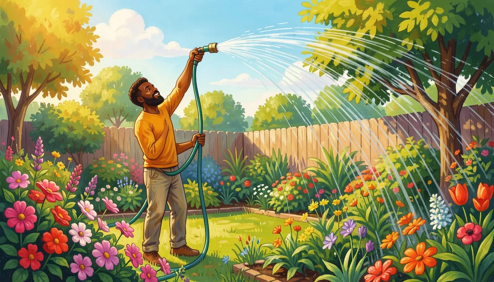

Zusammengesetzte Bewegungen
==========

## Der waagerechte Wurf

1. Nenne Beispiele, bei denen der waagerechte Wurf eine Rolle spielt.
2. Beschreibe die Bewegung als zwei Bewegungen, die gleichzeitig ablaufen.
3. Erkläre den Begriff Superposition.

[Multimedial mit viel mehr aufbereiteten Texten und Grafiken](https://www.leifiphysik.de/mechanik/waagerechter-und-schraeger-wurf/grundwissen/waagerechter-wurf)

### Beispielaufgabe

> Ein quadratisches Beet auf der Erde von 2x2m soll bewässert werden. das Wasser tritt mit einer Geschwindigkeit von 12 m/s aus dem Schlauch aus.

- Abstand, Schlauchhöhe, etc. 
- Wir wollen das ganze Beet bewässern können.
- Wie würde das auf dem Mond sein?

Vergleich mit dem [Original](https://www.leifiphysik.de/mechanik/waagerechter-und-schraeger-wurf/aufgabe/waessern-eines-beetes)

## Zwei gleichförmige sich überlagernde Bewegungen

> Oft findet man die Situation vor, dass sich das Medium bewegt, in dem man sich bewegt. Es gibt dann zwei **relative** Geschwindigkeiten, die sich zu einer **absoluten** Geschwindigkeit überlagern.

Hierzu einige Bilder:

### Beispiel Flussschifffahrt

Ich weise auf die wunderschönen triple-s- und triple-f-Schreibweise hin... was für ein wunderschönes Wort.

<iframe width="560" height="315" src="https://www.youtube.com/embed/Ue0Sag4qhe0?si=oWyLXKgWxDcje-2l" title="YouTube video player" frameborder="0" allow="accelerometer; autoplay; clipboard-write; encrypted-media; gyroscope; picture-in-picture; web-share" referrerpolicy="strict-origin-when-cross-origin" allowfullscreen></iframe>

Noch einmal deutlicher: **Es geht um die Fähre im Hintergrund, nicht um den Dampfer!**

<iframe width="560" height="315" src="https://www.youtube.com/embed/2dtcmxoUbTA?si=23ygkI5V-hIXtwox" title="YouTube video player" frameborder="0" allow="accelerometer; autoplay; clipboard-write; encrypted-media; gyroscope; picture-in-picture; web-share" referrerpolicy="strict-origin-when-cross-origin" allowfullscreen></iframe>

- Angenommen, ein Schiff kann maximal 10km/h fahren.
- Ein Fluss fließt mit 7km/h

#### Aufgaben

1. Bestimmen Sie die Geschwindigkeit des Schiffes mit einem Kurs:
    - Gegen die Strömung (vom Ufer aus gesehen)
    - Gegen die Strömung (von einem Floß aus gesehen)
    - Mit der Strömung (vom Ufer aus gesehen)
    - Mit der Strömung (von einem Floß aus gesehen)
    - Senkrecht zur Strömung (vom Ufer aus gesehen)
2. Erstelle für die verschiedenen Fälle eine Skizze, zeichne dabei die Geschwindigkeiten als Vektorpfeile ein.
3. Beschreibe Ähnlichkeiten und Unterschiede der senkrechten Bewegung zum Fluss und dem Beispiel mit dem Bewässern.
4. Bestimme, wie weit ein Boot abtreiben würde, wenn es einen 1km breiten Fluss senkrecht durchqueren würde. Erstelle hierzu ein Koordinatensystem und löse die Aufgabe zunächst graphisch. Löse das Problem anschließend mathematisch und gib dabei die Zeit an, die für das Erreichen des anderen Ufers notwendig ist.

### Exkurs: Schräger Wurf

Ausgangslage:

- Skizzen der echten Würfe
- Theorie: https://www.leifiphysik.de/mechanik/waagerechter-und-schraeger-wurf/grundwissen/schraeger-wurf-nach-oben-mit-anfangshoehe
- Sammlung von Fragen / Problemen, die man so lösen kann

Aufgabe:

1. Erstellen Sie eine Aufgabe, die später andere Schüler*innen der Klasse lösen sollen. Es geht beispielsweise darum, einen Gegenstand über ein Objekt zu werfen.
1. Nutzen Sie [den Simulator](https://www.leifiphysik.de/mechanik/waagerechter-und-schraeger-wurf/versuche/schraeger-wurf-simulation-von-walter-fendt), um ihre Aufgabe zu testen.
1. Gestalten Sie ein Aufgabenblatt und stellen Sie dieses einer zufälligen Person vor - bitten Sie um Verbesserungsvorschläge.
1. Überarbeiten Sie Ihr Aufgabenblatt.
1. Bei einer weiteren Zuordnung erhält ein*e Mitschüler*in die verbesserte Aufgabe und soll diese Lösen.
1. Kontrollieren Sie die Lösung.

