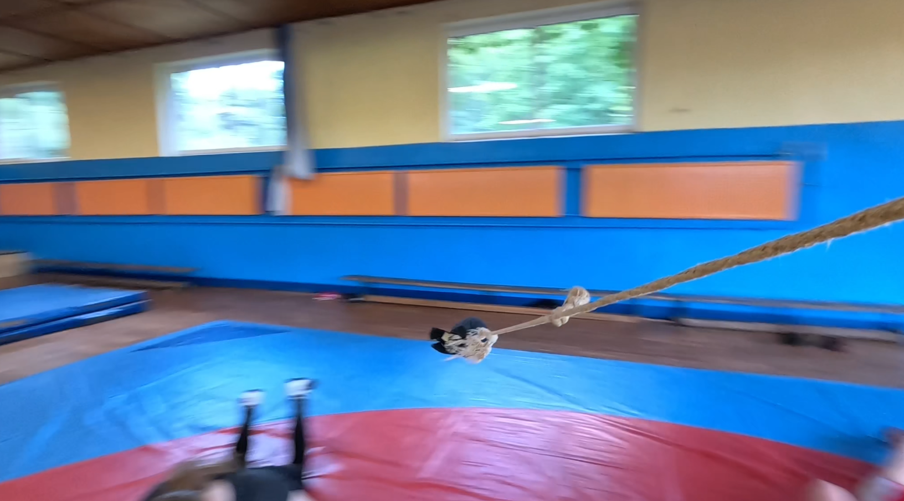

Kreisbewegung
=========

## Charakterisierung

Quelle und Material: https://www.leifiphysik.de/mechanik/kreisbewegung/grundwissen/charakterisierung-der-gleichfoermigen-kreisbewegung

- gleichförmige Kreisbewegung
- ungleichförmige Kreisbewegung

> Aufgaben lösen!
>
> Tafelbild und Mitschrift entwerfen

## Größen

https://www.leifiphysik.de/mechanik/kreisbewegung/grundwissen/groessen-zur-beschreibung-einer-kreisbewegung

### Aufgaben

1. Bestimmen Sie die (mittlere) Periode und Frequenz für meinen kreisenden Schlüsselbund.
2. Bestimmen Sie die Winkelgeschwindigkeit und die Bahngeschwindigkeit des Schlüsselbundes.

### Vertiefung / Wiederholung / Entspannung

https://www.leifiphysik.de/mechanik/kreisbewegung/grundwissen/bahngeschwindigkeit-und-winkelgeschwindigkeit

### Vertiefung

1. Bestimmen Sie, mit welcher Geschwindigkeit Sie sich im Augenblick um die Sonne bewegen.
1. Begründen Sie, weshalb Sie die Geschwindigkeit von Pfiffi im Video **nicht** bestimmen können.
2. https://www.leifiphysik.de/mechanik/kreisbewegung/aufgabe/die-turmuhr-des-hamburger-michel

### Quizzen

- https://www.leifiphysik.de/mechanik/kreisbewegung/aufgabe/quiz-zur-formel-fuer-die-winkelgeschwindigkeit
- https://www.leifiphysik.de/mechanik/kreisbewegung/aufgabe/quiz-zur-formel-fuer-die-bahngeschwindigkeit

## Beobachten und beschreiben

<iframe width="560" height="315" src="https://www.youtube.com/embed/K8bdYzUMJOo?si=a7SGIX9yttcx1Iwd" title="YouTube video player" frameborder="0" allow="accelerometer; autoplay; clipboard-write; encrypted-media; gyroscope; picture-in-picture; web-share" referrerpolicy="strict-origin-when-cross-origin" allowfullscreen></iframe>

und

https://youtube.com/shorts/0b40puT7N68?si=q6x9jsi281WhDaF7

> Beschreiben Sie den Zusammenhang zwischen Winkelgeschwindigkeit und Gewichtsverteilung bei variablem Radius.

> Stellen Sei eine Vermutung auf mit welchen Größen das zusammenhängen kann.

## Kräfte

### Zentrifugalkraft

> Der Wortstamm **fuge** leitet sich vom lateinischen Verb fugere (Infinitiv) ab, dessen Hauptformen fugiō, fūgī und fugitūrus lauten.  Es handelt sich um ein Verb der konsonantischen Konjugation auf -io. Die Grundbedeutung von fugere ist fliehen, entkommen oder meiden (oft mit Akkusativobjekt).

### Zentripetalkraft

> centripetal: zentripetal; zum Zentrum hin tendierend; bewegung zum Mittelpunkt

### Radialkraft

> wie der Radius nach innen wirkend

### Fliehkraft

> vom Radius weg führend...

### Aufgaben

1. Skizzieren Sie die Bewegung einer Münze auf einer rotierenden Scheibe und zeichnen Sie die Kräfte ein.
1. Recherchieren Sie die Formel für die Zentrifugalkraft.
2. Beobachten Sie die Münze auf der Drehscheibe: Welche Kraft wirkt als Zentripetalkraft? (Kontrolle: $F_H = m \cdot g \cdot \mu_H$ mit $\mu_H$ auf Holz von 0,5 bis 0,6)
3. Bestimmen Sie alle Größen, die Sie benötigen, um zu ermitteln ab welcher Winkelgeschwindigkeit die Münze von der Scheibe fliegt.
