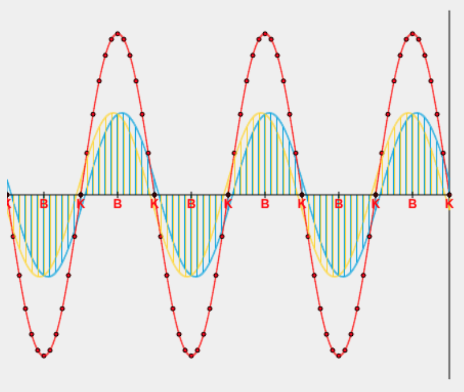

LK Physik Q3 Woche 03 und 04 Mechanische Wellen
==============================

[toc]

## Ziele

* Die Lernenden…
  * … veranschaulichen die Entstehung (stehender) Wellen in sachgerechten Darstellungsformen, auch mithilfe digitaler Werkzeuge. (K 6)
  * … präsentieren Eigenschaften und Anwendungen von Frequenzbereichen des elektromagnetischen Spektrums sach- und adressatengerecht unter Einsatz geeigneter analoger und digitaler Medien. (K 7)
  * … bilden sich reflektiert und rational in außerfachlichen Kontexten (z.B. „Handystrahlung“) ein eigenes Urteil. (B4)
  * … reflektieren Risikoeinschätzungen zur Mobilfunktechnologie („Handystrahlung“) hinsichtlich der Güte des durchgeführten Bewertungsprozesses. (B 5)
* Basiskonzepte
  * Superposition und Komponenten
    * Erklärung von Interferenzphänomenen mithilfe der Superposition von Wellen

## Inhalte

### Stehende Wellen

[Simulation einer stehenden Welle](https://www.leifiphysik.de/mechanik/mechanische-wellen/versuche/stehende-welle-simulation)

1. ~Beschreiben Sie das Phänomen, der stehenden Welle, wie in dem Applet zu beobachten war.~
1. ~Erklären Sie das Phänomen.~
1. ~Formulieren Sie Bedingungen für das Entstehen einer stehenden Welle.~
1. ~Erläutern Sie die Konzepte "Wellenknoten" und "Wellenbauch" einer stehenden Welle.~
1. Skizzieren Sie eine stehende Welle im Hefter.

### Elektromagnetische Wellen

<iframe width="560" height="315" src="https://www.youtube.com/embed/H7_vpO33P04?si=TLJqzW8bInB-iai_" title="YouTube video player" frameborder="0" allow="accelerometer; autoplay; clipboard-write; encrypted-media; gyroscope; picture-in-picture; web-share" referrerpolicy="strict-origin-when-cross-origin" allowfullscreen></iframe>

<iframe width="560" height="315" src="https://www.youtube.com/embed/Uj8oN3WETKo?si=62StSJ8o37iVA5ri" title="YouTube video player" frameborder="0" allow="accelerometer; autoplay; clipboard-write; encrypted-media; gyroscope; picture-in-picture; web-share" referrerpolicy="strict-origin-when-cross-origin" allowfullscreen></iframe>

#### Material

> Das Prinzip der elektrischen Dipolantenne geht auf den deutschen Physiker Heinrich Hertz zurück, der im Jahr 1886 als Erster elektromagnetische Wellen experimentell nachweisen konnte. Sein Dipol (Hertzscher Dipol), der wesentlich kleiner als λ/8 war, hat nur noch theoretische Bedeutung. Die Verlängerung auf etwa λ/2 führt zu einer Resonanz, die die Anpassung der Antenne an die Speiseleitung erleichtert und den Wirkungsgrad erhöht. Der russische Physiker Alexander Stepanowitsch Popow verwendete 1895 erstmals eine Dipolantenne zum Empfang elektromagnetischer Wellen.
>
> https://de.wikipedia.org/wiki/Dipolantenne

- Hertzscher Dipol (LBS. 230)
- [Youtube: Elektromagnetische Welle 1](https://www.youtube.com/watch?v=FLQ1nDHi_uk)

#### Aufgaben

- Nahfeld und Fernfeld skizzieren
- Erstellen Sie eine Tabelle mit den einzelnen Schritten zur Abstrahlung einer Welle in 
- Resonanzfrequenz des Dipols erklären
- Resonanzfrequenz einer Dipolantenne für eine bestimmte Frequenz bestimmen.
- Ausbreitungsgeschwindigkeit EMW
- Übungen LBS. 244 Nr. 7,8,9 (Fritz: 102,6), 12

## Transparenzdokument für die Klausur am Donnerstag, den 9.10.

- Skizzen von EM-Wellen nah, EM-Wellen fern, Dipol, Schwingkreis
- Entstehung von EM-Wellen
- optimale (minimale) Länge eines Dipols bestimmen
- Länge einer realistischen Antenne abschätzen/bestimmen
- [Polarisation](https://de.wikipedia.org/wiki/Polarisation) und [Wirkungen von gleich oder unterschiedlich polarisierten Empfänger und Sender](https://www.dl3ftz.de/horizontale-und-vertikale-polarisation-bei-antennen/) begründen
- Leistung und Frequenz im Zusammenhang mit dem Absorbtionsvermögen in verschiedenen Medien und an Grenzflächen verstehen
- Ursache für schlechten Empfang in Gebäuden erläutern
- elektromagnetische Spektrum graphisch wiedergeben
