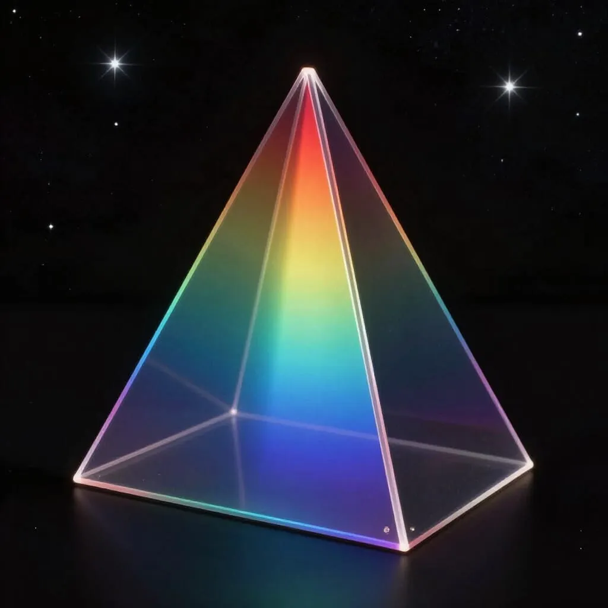

Start in Q4
================

## Ziele

Die Lernenden…

- entwickeln Fragestellungen zur Analyse von Linienspektren. (E 1)
- erklären die Entstehung von Absorptionslinien unter Nutzung eines Energieniveauschemas. (S 1)
- veranschaulichen Orbitale des Wasserstoffatoms mithilfe geeigneter Software (K 6)

# Inhalte

## Einführung in die Spektrallinien

Harald Lesch erklärt: https://www.youtube.com/watch?v=imTFizzJ3P8

### 1. Runde

Einfach anschauen
### 2. Runde

> Folgende Aufgaben auf Basis der Informationen aus dem Video erfüllen

1. Zusammenhang von Spektren und Astronomie erklären
1. Erläutern der Geschichte von Spektren und Spektrallinien
1. Herkunft der Spektrallinien im Sonnenlicht erläutern
1. Beitrag von Spektren zur Quantenphysik beurteilen
1. Erläutern Sie den Begriff "molekulares Skalpell"
1. Erläutern Sie den Zusammenhang zwischen Planetenbewegung, Blau- und Rotverschiebung, sowie Spektrallinien.
1. Begründen Sie die Bedeutung von Absorptionslinien für die Astrophysik anhand der Beobachtungsmöglichkeiten.
  
Freiwillig gern vom Studytiger erklären lassen: https://www.youtube.com/watch?v=B12E72jyOHI

### kontinuierliches Spektrum (VIS)

### Emissionslinien 

### Absorbtionslinien

### Rotverschiebung

> Illustration der Rotverschiebung der Spektrallinien für einen weit entfernten Supergalaxienhaufen (BAS11) rechts im Vergleich zur Sonne links

#### Doppler-Effekt

[Zum Hören](https://upload.wikimedia.org/wikipedia/commons/9/90/Speeding-car-horn_doppler_effect_sample.ogg)

> Objekte, die sich auf einen Betrachter zu bewegen, haben eine kürzere Wellenlänge (Blauverschiebung), die sich weg bewegen eine größere Wellenlänge (Rotverschiebung)

Details: https://de.wikipedia.org/wiki/Doppler-Effekt#Astrophysik_und_allgemeine_Physik

## Spektren durch Simulationen besser verstehen

- https://phet.colorado.edu/de/simulations/molecules-and-light 
- https://phet.colorado.edu/sims/cheerpj/discharge-lamps/latest/discharge-lamps.html?simulation=discharge-lamps&locale=de 
- https://www.kippenbergs.de/app/mint-index-physics

> Erklären Sie im Hefter die Emission von Licht in einer Gasentladungslampe.

## Linienspektren im Lehrbuch

Fokus Physik SII S. 332

> Bestimmen Sie die Wellenlängen der ersten drei Emissionslinien von Wasserstoff.

## Energieniveauschemata

<!--https://www.leifiphysik.de/atomphysik/atomarer-energieaustausch/downloads -->

- Simulation 1: https://www.leifiphysik.de/atomphysik/atomarer-energieaustausch/downloads/energieabgabe-durch-emission-prinzip-animation
- Simulation 2: https://www.leifiphysik.de/atomphysik/atomarer-energieaustausch/downloads/energieabgabe-durch-emission-varianten-animation
- Skizzieren Sie zwei EN-Schemata
    - todo

## Tafelbild mit allen Erkenntnissen

* Entstehung von Licht auf atomarer Ebene
* Entstehung von "weißem" / heißem Licht (kontinuierliche Spektren)
* Entstehung von Absorbtionslinien
* Entstehung von Emissionslinien (Linienspektren)
* Balmer-Serie

## Aufgabe

Balmer-Gleichung benutzen, um Emissionslinien zu berechnen.

## Test

not here yet

## Planung für Experimente zu Hause

* Können wir mit Gittern oder Prismen Spektren sichtbar machen?
* Was erfahren wir aus dem Betrachten einer CD/DVD?
* Können Sie Ihre Experimente als Videos festhalten und anderen SuS zur Verfügung stellen?

